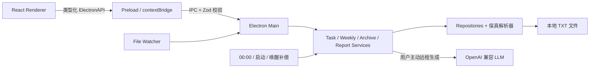

<div align="center">

# 悬浮便利贴 & 一键周报

**贴在桌面上的本地优先任务清单：随手记录，自动归档，并可选择本地模板或远程 LLM 生成周报。**


[功能亮点](#功能亮点) · [快速开始](#快速开始) · [数据设计](#数据设计) · [开发文档](#开发文档)

</div>

---

## 项目介绍

悬浮便利贴是一款本地优先的 Electron 桌面工具，适合需要随手记录每日任务、又不想使用复杂项目管理软件的人。

它会把今日已完成事项按完成日期归档到周记，并通过系统保存对话框导出可以直接编辑和发送的纯文本周报。任务与模板保存在本机；默认本地模式完全不联网。用户也可以主动配置 DeepSeek、通义千问、Kimi、智谱、本地模型或自建 OpenAI 兼容服务，生成完整周报。

```text
记录今日任务  →  勾选完成  →  每日零点自动归档  →  查看周记  →  导出 TXT 周报
```

## 功能亮点

| 能力        | 说明                                                               |
| ----------- | ------------------------------------------------------------------ |
| 🗒️ 桌面悬浮 | 无边框便利贴窗口、始终置顶、拖动和尺寸记忆                         |
| ✅ 今日任务 | 添加、完成、撤销、内联编辑、删除，完成时自动记录时间               |
| 📅 自动周记 | 每日零点归档，启动、系统唤醒和操作前均有补偿检查                   |
| 🕰️ 历史补录 | 查看历史日期，并为过去某天补录、编辑或删除完成事项                 |
| 📖 周视图   | 查看当前周或历史周，当前周实时合并当天尚未归档的数据               |
| 🎨 个性设置 | 设置便利贴颜色、不透明度、置顶和已完成区域状态                     |
| 📝 双模板   | 分别编辑本地工作记录模板、远程完整周报模板和写作提示词，并本地预览 |
| 🤖 远程生成 | 支持国产模型预设、本地服务和自定义 OpenAI 兼容 URL                 |
| 🔄 外部同步 | 手动编辑 TXT 后自动刷新界面，无法识别的行会保留并记录日志          |
| 🔒 本地优先 | 无账号、无遥测、无云同步；只有用户主动测试或生成时才访问远程服务   |

其他桌面能力包括：

- 系统托盘与关闭后隐藏。
- 单实例运行。
- 悬浮窗置顶切换。
- 点击菜单外部或按 `Esc` 自动关闭菜单。
- UTF-8、LF/CRLF 和文件末尾换行保真。
- 支持完全相同的重复任务，按所在行精确操作。

## 当前状态

核心功能已完成，项目目前适合源码运行、继续开发和本地构建。

| 项目                               | 状态                                  |
| ---------------------------------- | ------------------------------------- |
| 今日任务、历史补录、周记、归档     | ✅ 已实现                             |
| 本地模板与 TXT 周报导出            | ✅ 已实现                             |
| 自定义模板、提示词和保存前预览     | ✅ 已实现                             |
| 远程 LLM 配置、连接测试和周报生成  | ✅ 已实现                             |
| macOS Apple Silicon 本地构建       | ✅ 已完成冒烟验证                     |
| Windows 安装包                     | 🧪 已配置 NSIS，尚待 Windows 实机验收 |
| macOS 签名、公证和正式应用图标     | ⏳ 尚未配置                           |
| 远程授权绑定 origin 与声明版本     | ⏳ 待完善                             |
| 多文件设置保存的事务一致性         | ⏳ 待完善                             |

> 当前 macOS 构建未进行 Apple Developer ID 签名和公证，首次打开时可能出现系统安全提示。正式发布安装包前需要完成签名、公证和图标配置。

## 快速开始

### 环境要求

- Node.js 22 或更高版本
- pnpm 11.19.0
- macOS 11+ 或 Windows 10+

如果尚未安装 pnpm：

```bash
npm install -g pnpm@11.19.0
```

也可以通过 Corepack 启用：

```bash
corepack enable
corepack prepare pnpm@11.19.0 --activate
```

### 获取并运行

```bash
git clone https://github.com/StoneNbc/To-do-for-weekly-report.git sticky-weekly
cd sticky-weekly
pnpm install
pnpm dev
```

`pnpm dev` 会同时启动固定在 `127.0.0.1:5173` 的 Vite、Main/Preload 增量构建和 Electron。停止运行时在终端按 `Control + C`，不要用 `Control + Z` 暂停进程；端口已占用时命令会直接报错，不会自动切换到错误端口。

### 质量检查

```bash
pnpm typecheck
pnpm lint
pnpm test
pnpm build
```

当前测试基线为 **37 个测试文件、151 个测试通过**，覆盖文本解析、Repository、归档、IPC、文件监听、模板、远程 LLM 策略、周报导出和 Renderer 交互。

## 使用方式

### 今日便利贴

1. 在底部输入任务并按回车或点击“添加”。
2. 点击复选框完成任务，应用会记录本机完成时间。
3. 再次点击可撤销完成；双击任务文本可以编辑。
4. 已完成事项保留至下一个零点，然后归档到对应周文件。

未完成任务会一直顺延，直到被完成或删除；顺延不会记录最初创建日期。

### 历史补录

使用顶部日期箭头进入过去日期，即可补录实际在那一天完成、但当时忘记记录的事项。历史补录按选择的完成日期写入对应周文件。

### 导出周报

从悬浮窗菜单或周记窗口点击导出：

- 本地模式使用本地 TXT 工作记录模板，不联网。
- 远程模式将本地工作记录、当前未完成待办、完整周报模板和提示词发送到用户配置并确认的服务，生成后可以预览和编辑。
- 最终内容只写入系统保存对话框选择的位置；取消选择不会创建文件，应用也不会额外保留内部副本。

## 数据设计

所有业务数据均为人可以直接阅读和修改的纯文本：

```text
data/
├── today.txt
├── weeks/
│   └── week-2026-W33.txt
├── config.json
├── report-template.txt
├── remote-report-template.txt
├── report-prompt.txt
├── secrets.json
└── logs/
    └── app.log
```

开发环境数据位于项目根目录的 `data/`。打包应用数据位于 Electron 的 `userData/data/`；macOS 默认通常为：

```text
~/Library/Application Support/sticky-weekly/data
```

`today.txt` 示例：

```markdown
# 2026-08-13

- [ ] 准备周会材料
- [x] 回复客户邮件 @14:20
```

周文件示例：

```markdown
# 第33周 (2026-08-10 ~ 2026-08-16)

## 周四 08-13

- 回复客户邮件 @14:20
```

应用允许直接用文本编辑器修改这些文件：

- 合法任务会自动显示到界面。
- 完全相同的任务不会被去重。
- 无法识别的行原样保留，但不会作为任务展示。
- 文件发生外部变化时，应用会刷新数据并保护用户免受旧版本覆盖。

## 技术架构



主要技术栈：

- Electron 37
- React 18 + TypeScript 5
- Tailwind CSS 3
- Zod IPC 校验
- chokidar 文件监听
- node-cron 定时任务
- fs-extra 原子写入
- Vitest + Testing Library
- Vite + tsup + electron-builder

Renderer 不直接读取文件系统，所有业务读写通过 Preload 暴露的冻结 API 进入 Main Process。Repository 使用文件 revision 和行号定位任务，以正确支持重复内容和外部编辑冲突。

## 项目结构

```text
src/
├── main/
│   ├── agents/          # 本地模板与 OpenAI 兼容远程 Agent
│   ├── ipc/             # IPC 通道、Schema 与处理器
│   ├── parsers/         # today/week 文本保真解析
│   ├── repositories/    # 原子读写与 revision 冲突保护
│   ├── services/        # 任务、归档、周记、监听、导出
│   └── platform/        # 路径、显示器、网络与 Shell 能力
├── preload/             # contextBridge 安全 API
├── renderer/            # React 页面、组件、状态与 Gateway
└── shared/              # 领域类型、日期与校验

tests/
├── unit/
├── integration/
└── renderer/

documents/               # PRD、开发设计、交接与协作说明
```

## 开发命令

| 命令              | 用途                                          |
| ----------------- | --------------------------------------------- |
| `pnpm dev`        | 启动 Renderer、Main/Preload watch 和 Electron |
| `pnpm typecheck`  | TypeScript 全量类型检查                       |
| `pnpm lint`       | ESLint 全量检查                               |
| `pnpm test`       | 运行全部 Vitest 测试                          |
| `pnpm test:watch` | 监听模式运行测试                              |
| `pnpm build`      | 构建 Renderer、Main 和 Preload                |
| `pnpm package`    | 构建目录形式的本地应用包                      |
| `pnpm dist`       | 构建平台分发包                                |
| `pnpm dist:mac`   | 构建 macOS 通用 DMG 与 ZIP                    |
| `pnpm dist:win`   | 构建 Windows x64 NSIS 安装包                  |
| `pnpm format`     | 使用 Prettier 格式化项目                      |

## 构建应用

本机目录包：

```bash
pnpm package
```

平台分发包：

```bash
pnpm dist
```

输出目录为 `release/`。构建配置当前包含：

- macOS：DMG 与 ZIP。
- Windows：NSIS 安装包。

构建 Windows 安装包建议在 Windows 环境或对应 CI Runner 中执行并完成实机验收。

仓库提供 `Build desktop installers` GitHub Actions 工作流。它可以手动触发，验证通过后分别上传 macOS 通用 DMG/ZIP 和 Windows x64 NSIS 安装包；详细操作与未签名提示见[试用版打包与分发](./documents/试用版打包与分发-v1.0.md)。

## 开发文档

- [开发交接文档](./documents/开发交接文档-v1.0.md)：环境、架构、模块职责、调试和已知风险。
- [产品需求文档](./documents/产品需求文档-悬浮便利贴与一键周报-v3.1.md)：完整产品规则和验收标准。
- [开发设计文档](./documents/开发设计文档-悬浮便利贴与一键周报-v1.0.md)：技术方案、数据流与模块设计。
- [远程 LLM 需求文档](./documents/自定义周报模板与远程LLM需求文档-v1.0.md)：双模板、提示词、隐私和验收边界。
- [远程 LLM 开发设计](./documents/自定义周报模板与远程LLM开发设计-v1.0.md)：凭据、网络、Agent 和草稿设计。
- [试用版打包与分发](./documents/试用版打包与分发-v1.0.md)：双平台安装包、下载、校验与签名说明。
- [多 Agent 并行开发策略](./documents/多Agent并行开发策略-v1.0.md)：并行开发边界和交付要求。
- [Agent 协作约束](./documents/AGENTS.md)：修改代码前必须遵守的核心约束。

## 路线图

- [ ] 正式应用图标和托盘图标。
- [ ] macOS Developer ID 签名与公证。
- [ ] Windows 10/11 实机打包与验收。
- [ ] Electron GUI 自动化测试。
- [x] 设置窗口、便利贴颜色/透明度与本地诊断入口。
- [x] 自定义本地/远程周报模板、提示词与预览。
- [x] DeepSeek、通义千问、Kimi、智谱、本地及自定义兼容服务。
- [x] 设置页未保存修改提醒与最小化连接测试请求。
- [ ] 将远程授权绑定到服务 origin 和隐私声明版本。
- [ ] 模板、提示词与配置的跨文件事务提交或失败回滚。

## 参与开发

欢迎通过 Issue 提交问题或建议，也欢迎提交 Pull Request。开始修改前请先阅读[开发交接文档](./documents/开发交接文档-v1.0.md)和 [Agent 协作约束](./documents/AGENTS.md)。

提交变更前至少运行：

```bash
pnpm typecheck
pnpm lint
pnpm test
pnpm build
```

请勿提交本机的 `data/`、`release/`、日志文件或个人周报。

## 隐私说明

- 应用不要求登录，不包含遥测和分析代码。
- 任务、周记和报告均保存在用户本机。
- 默认本地模式只进行模板渲染，不调用任何 AI 服务。
- 只有用户主动测试连接或选择远程生成时，Main Process 才会访问配置的服务。
- 连接测试只发送固定短文本、连接参数和必要凭据，不发送任务、模板或提示词。
- 远程生成会发送界面明确说明的工作记录、未完成待办候选、完整模板和提示词；API Key 使用系统安全存储加密后保存在本机。

## License

当前仓库尚未添加开源许可证。除非项目所有者另行授权，仓库内容默认保留全部权利。

---

<div align="center">

如果这个项目对你有帮助，欢迎点一个 Star ⭐

</div>
