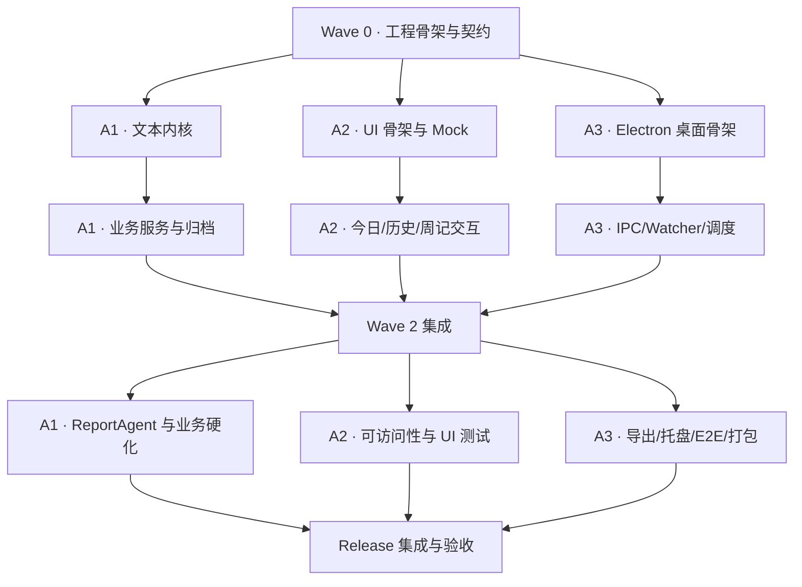

# 多 Agent 并行开发策略 — 悬浮便利贴 & 一键周报

| 项目 | 内容 |
| --- | --- |
| 策略版本 | v1.0 |
| 日期 | 2026-08-13 |
| 对应 PRD | 《产品需求文档-悬浮便利贴与一键周报-v3.1》 |
| 对应开发设计 | 《开发设计文档-悬浮便利贴与一键周报-v1.0》 |
| 推荐并发规模 | 1 个集成协调 Agent + 3 个执行 Agent |
| 当前项目状态 | 只有需求与设计文档，尚未初始化 Git 和工程骨架 |

---

## 1. 策略目标

本策略用于让多个 Agent 在尽量少互相等待、少产生代码冲突的前提下，并行完成悬浮便利贴 v1.0。

它解决的不是简单的“把功能平均分给几个人”，而是以下工程问题：

- 哪些工作可以真正并行，哪些必须先冻结契约。
- 每个 Agent 能修改哪些文件，哪些文件禁止自行修改。
- Agent 如何在独立分支和 Worktree 中工作。
- 如何避免多个 Agent 同时改 `package.json`、共享类型、IPC 契约等热点文件。
- 每一波次应该从什么基线开始，在什么条件下才能合并。
- 如何把测试、交接说明和验收证据纳入每个 Agent 的交付物。
- 出现接口变更、外部文件变化或跨模块故障时由谁裁决。

并行开发的基本单位是“可独立验证的任务包”，不是单个文件或模糊的功能描述。

---

## 2. 推荐团队拓扑

推荐同时使用 4 个 Agent 席位：

| 角色 | 代号 | 主要责任 | 是否直接开发功能 |
| --- | --- | --- | --- |
| 集成协调 Agent | A0 | 工程引导、契约冻结、分派、评审、合并、全量验证 | 只处理共享骨架和集成问题 |
| 文本与业务内核 Agent | A1 | 日期、解析器、Repository、任务/周记/归档、模板生成 | 是 |
| React 界面 Agent | A2 | 悬浮窗、历史模式、周记页、状态、交互、可访问性 | 是 |
| Electron 平台 Agent | A3 | 主进程生命周期、窗口、托盘、Preload、IPC、Watcher、调度、导出对话框 | 是 |

### 2.1 为什么推荐 4 个席位

- A1、A2、A3 的主要文件目录天然分离，适合并行。
- A0 持有共享契约和集成分支，避免三个执行 Agent 互相覆盖。
- 当前应用体量不适合过早拆成 8–10 个 Agent；协调成本会高于新增并行收益。
- 文本保真、归档和跨年 ISO 周是高风险内核，应由一个 Agent 贯穿，不能拆散后拼装。
- Electron 生命周期、Watcher 和 IPC 存在紧密耦合，归给一个平台 Agent 更稳妥。

### 2.2 A0 的职责边界

A0 不是第四个随意抢任务的开发 Agent。它负责：

- 建立项目、Git、基础脚本和共享契约。
- 创建每一波次的干净基线。
- 审核是否越权修改共享文件。
- 按固定顺序合并任务分支。
- 运行全量类型检查、测试和构建。
- 只修复集成胶水，不替执行 Agent 隐性重写其模块。
- 发现模块缺陷时优先退回原 Agent 修复。
- 维护问题清单、决策记录和验收映射。

如果由你本人负责最终决策，可以让 A0 作为“技术负责人 Agent”，所有产品歧义由 A0 汇总后交给你确认。

---

## 3. 并行开发的前置条件

当前目录还不是 Git 仓库，也没有工程骨架。因此不能立即让多个 Agent 同时创建项目文件。必须先完成一个短暂的串行阶段。

### 3.1 Wave 0 必须单 Agent 执行

Wave 0 由 A0 单独完成：

1. 初始化 Git 仓库。
2. 创建 Electron + React + TypeScript + Vite 工程。
3. 锁定包管理器和依赖版本，提交 lockfile。
4. 建立开发设计文档约定的目录骨架。
5. 建立 TypeScript、ESLint、Prettier、Vitest 基础配置。
6. 冻结共享领域类型、IPC 通道名、API 返回结构和错误码。
7. 建立三个执行 Agent 可独立运行的测试与构建命令。
8. 创建第一次可构建基线并打 Tag。

Wave 0 完成前，A1、A2、A3 不写生产代码。它们可以阅读文档、准备测试用例，但不提交工程文件。

### 3.2 Wave 0 的最低通过门槛

必须同时满足：

- `pnpm install` 成功。
- `pnpm typecheck` 成功。
- `pnpm lint` 成功。
- `pnpm test` 成功，即使当前只有冒烟测试。
- `pnpm build` 成功。
- Electron 开发模式能分别加载 note 与 weekly 页面占位内容。
- Preload 能暴露一个只读健康检查 API。
- Git 工作区干净。

建议将该基线标记为：

```text
baseline/wave-0
```

---

## 4. Git 与 Worktree 策略

### 4.1 不允许多个写入 Agent 共用同一 Checkout

首选模式是每个 Agent 一个独立 Git Worktree。原因：

- 防止一个 Agent 的未提交修改被另一个 Agent 覆盖。
- 每个 Agent 能独立安装、测试和提交。
- A0 可以在集成 Worktree 中逐个合并。
- 出现失败时可直接丢弃任务分支，不污染其他工作。

推荐目录示意：

```text
便利贴/                         # A0 集成工作区
便利贴-worktrees/
├── core-w1/                    # A1 当前波次
├── renderer-w1/                # A2 当前波次
└── platform-w1/                # A3 当前波次
```

### 4.2 分支命名

```text
main                            # 已通过完整质量门禁的稳定线
integration/wave-1              # 当前波次集成分支
agent/core/wave-1               # A1
agent/renderer/wave-1           # A2
agent/platform/wave-1           # A3
```

下一波次不建议继续使用旧的长期分支。Wave 1 全部合并并验证后：

1. 将 `integration/wave-1` 合入 `main`。
2. 标记 `baseline/wave-1`。
3. 从该 Tag 或最新 main 新建 Wave 2 的三个任务分支。
4. 删除已完成的 Wave 1 Worktree 和本地任务分支。

这种“每波次短分支”策略可以显著减少 Agent 分支持续漂移。

### 4.3 建议初始化命令

以下命令供 A0 执行，实际脚手架确定后再使用：

```bash
git init
git add .
git commit -m "docs: add product and development specifications"
git branch -M main
```

完成 Wave 0 后建立 Worktree：

```bash
git branch integration/wave-1
git branch agent/core/wave-1 baseline/wave-0
git branch agent/renderer/wave-1 baseline/wave-0
git branch agent/platform/wave-1 baseline/wave-0

git worktree add ../便利贴-worktrees/core-w1 agent/core/wave-1
git worktree add ../便利贴-worktrees/renderer-w1 agent/renderer/wave-1
git worktree add ../便利贴-worktrees/platform-w1 agent/platform/wave-1
```

命令只是操作范式。A0 必须先确认路径不存在且不会覆盖用户数据。

### 4.4 提交规则

- 一个提交只完成一个可描述的技术目的。
- 禁止提交构建产物、开发数据、日志、临时 TXT 和安装包。
- 禁止执行 `git reset --hard`、强制推送或覆盖其他 Agent 分支。
- 每个任务包至少有一个实现提交和相应测试提交；也可以合并为一个原子提交。
- Commit message 使用清晰前缀：`feat`、`fix`、`test`、`refactor`、`build`、`docs`。
- Agent 在交接前必须保持自己的 Worktree 干净。

---

## 5. 契约冻结策略

并行能否成功，主要取决于共享契约是否在 Wave 0 冻结。

### 5.1 A0 独占的共享文件

以下文件由 A0 持有，执行 Agent 默认只读：

```text
package.json
pnpm-lock.yaml
tsconfig*.json
vite.config.*
electron-builder.yml
eslint.config.*
src/shared/domain.ts
src/shared/results.ts
src/shared/constants.ts
src/main/ipc/channels.ts
src/main/ipc/schemas.ts
src/preload/apiTypes.ts
src/renderer/types/global.d.ts
```

执行 Agent 如果需要修改这些文件，不能直接提交。必须发起“契约变更请求”。

### 5.2 Wave 0 应冻结的内容

- `TaskLocator`、`TodaySnapshot`、`DayRecordSnapshot`、`WeeklySnapshot`。
- `ApiResult<T>` 和错误码。
- IPC 通道名称与输入输出类型。
- 文件变化事件类型。
- ReportAgent 与 ReportContext。
- AppConfig 的 v1.0 字段。
- 核心服务接口。
- 各脚本名称：`typecheck`、`lint`、`test`、`build`、`test:e2e`。
- Renderer 使用的 ElectronAPI 类型。

### 5.3 契约变更请求格式

```markdown
## Contract Change Request

- 发起 Agent：A2
- 当前波次：Wave 2
- 需要修改：TodaySnapshot 增加 warningsCount
- 原因：界面需要展示格式警告数量
- 不修改的替代方案：Renderer 使用 warnings.length
- 影响模块：shared、preload、renderer
- 是否阻塞当前任务：否
- 建议决定：拒绝，使用现有 warnings.length
```

A0 可以批准、拒绝或延期。批准后由 A0 修改契约并给三个任务分支同步一个专门的契约提交。

### 5.4 契约兼容原则

- 优先新增可选字段，不修改现有字段语义。
- 禁止为方便某个页面而让 Main 返回未经定义的临时对象。
- 禁止执行 Agent 在本模块复制一份“相似类型”绕过共享契约。
- 未冻结的新接口必须先用 Mock 和 Adapter 隔离，不能阻塞无关 Agent。

---

## 6. 文件所有权矩阵

### 6.1 A1：文本与业务内核

允许修改：

```text
src/shared/dateUtils.ts
src/shared/validation.ts
src/main/parsers/**
src/main/repositories/**
src/main/services/taskService.ts
src/main/services/weeklyService.ts
src/main/services/archiveService.ts
src/main/agents/**
tests/unit/date*/**
tests/unit/parser*/**
tests/integration/repositories/**
tests/integration/services/**
tests/fixtures/**
```

不得修改：Renderer、WindowManager、Preload API、IPC 通道、构建配置。

### 6.2 A2：React 界面

允许修改：

```text
src/renderer/**
tests/renderer/**
```

不得修改：Main 服务、Preload 实现、共享契约、包依赖和构建配置。

A2 在平台接口未完成前使用严格遵循 ElectronAPI 类型的 Mock Gateway，不可直接 import Main 文件。

### 6.3 A3：Electron 平台集成

允许修改：

```text
src/main/index.ts
src/main/appLifecycle.ts
src/main/windowManager.ts
src/main/trayManager.ts
src/main/menuFactory.ts
src/main/ipc/registerHandlers.ts
src/main/services/scheduler.ts
src/main/services/fileWatcher.ts
src/main/services/reportService.ts
src/main/services/configService.ts
src/main/platform/**
src/main/logging/**
src/preload/index.ts
tests/integration/ipc/**
tests/integration/watcher/**
tests/e2e/**
build/**
```

不得修改：解析器、Repository、业务服务实现、Renderer、共享契约。

### 6.4 A0：协调与集成

允许修改所有共享骨架与配置文件，但集成期间遵守：

- 不以“解决冲突”为名改写执行 Agent 的完整实现。
- 单纯冲突由文件所有者先提供建议。
- 需要跨目录修改的修复先记录归属，再交给对应 Agent。
- 只有小于约 20 行且纯粹为连接接口的胶水修复可由 A0 直接完成。

### 6.5 所有权冲突规则

同一波次内，同一个生产文件只能有一个所有者。

如果一个任务确实需要跨所有权目录：

1. 拆成两个提交，由对应 Agent 分别完成。
2. 用已经冻结的接口连接。
3. 在集成分支验证完整行为。

禁止让两个 Agent 同时编辑同一个文件后依靠 A0 手工拼接。

---

## 7. 依赖关系与关键路径



### 7.1 真正的关键路径

关键路径为：

```text
共享契约 → 文本解析与存储 → Task/Weekly/Archive Service
→ IPC/Preload 真实接线 → 端到端验收
```

UI 可以较早并行，但真实接线必须等待服务契约可用。为了不让 A2 空等，Wave 1 使用类型化 Mock，Wave 2 再替换为真实 ElectronAPI。

### 7.2 不应并行的工作

以下工作不允许由多个 Agent 同时进行：

- 项目脚手架和包依赖初始化。
- 共享类型与 IPC 契约设计。
- 同一个解析器文件的实现。
- 同一个窗口的生命周期管理。
- 全量合并与版本发布。
- 对失败归档规则的产品语义修改。

---

## 8. 总体波次计划

| 波次 | A0 | A1 文本与业务 | A2 React | A3 Electron 平台 | 退出条件 |
| --- | --- | --- | --- | --- | --- |
| Wave 0 | 初始化、契约、工具链 | 只评审 | 只评审 | 只评审 | 基线构建通过 |
| Wave 1 | 分派、契约答疑 | 文本内核 | UI 骨架 + Mock | 桌面骨架 | 三分支独立测试通过 |
| Wave 1 集成 | 按顺序合并 | 修复内核问题 | 修复 UI 问题 | 修复平台问题 | 全量门禁通过 |
| Wave 2 | 新基线、协调 | 业务服务与归档 | 完整功能交互 | IPC、Preload、Watcher、调度 | 垂直功能可运行 |
| Wave 2 集成 | 真实接线与全量验证 | 缺陷修复 | 缺陷修复 | 缺陷修复 | 核心验收通过 |
| Wave 3 | 发布协调 | Agent/模板与业务硬化 | UI 无障碍与组件测试 | 导出、桌面集成、E2E、打包 | Release Candidate |
| Wave 4 | 最终验收 | 支援修复 | 支援修复 | 支援修复 | PRD 20 条全部有证据 |

---

## 9. Wave 0：工程引导与契约冻结

### 9.1 A0 任务包

交付内容：

- Git 仓库与 `.gitignore`。
- `package.json` 与 lockfile。
- Main、Preload、Renderer 三套 TypeScript 构建。
- 基础目录结构。
- 共享领域类型。
- IPC 通道、schemas 和 ElectronAPI 类型。
- `ApiResult`、错误码和 DataChangedEvent。
- 测试框架与临时数据目录工具。
- 两个页面占位视图。
- `README.md` 中的开发命令。
- `AGENTS.md`，记录文件所有权和禁止事项。

### 9.2 契约验证

- Renderer 可以引用 `window.electronAPI` 类型。
- Preload 实现必须满足 ElectronAPI 类型。
- IPC Handler 的输入 schema 与 API 输入一致。
- 测试可以用 MockElectronAPI 替换真实 Preload。
- Main 不引用 Renderer 代码。
- Renderer 不引用 Main 代码。

### 9.3 A0 交付给三个 Agent 的启动包

每个 Agent 收到：

- 本策略文档。
- PRD 与开发设计文档。
- 本波次 Task Card。
- 允许修改的目录。
- 禁止修改的文件。
- 基线 Commit SHA。
- 必须运行的验证命令。
- 交接模板。

---

## 10. Wave 1：三路基础建设

### 10.1 A1 任务包：文本内核

目标：建立所有业务功能可以信任的纯文本数据层。

范围：

1. `dateUtils.ts`：本地日期、ISO week-year、周范围、跨年计算。
2. `lineEndings.ts`：LF/CRLF、结尾换行、BOM 容错。
3. `todayParser.ts`：保真 AST、标准任务、未知行和警告。
4. `weekParser.ts`：周头、日期段、任务、未知行和重复日期段。
5. `textFileStore.ts`：revision、路径写队列、原子写入。
6. `todayRepository.ts` 与 `weekRepository.ts`。
7. Fixtures 与字节级保真测试。

必须证明：

- 两条完全相同任务能被分别定位。
- 修改其中一条不会修改另一条。
- 未知行在写回后仍存在。
- CRLF 文件不会被无条件转换为 LF。
- 跨年 ISO 周文件名正确。
- revision 不一致时拒绝写入。

不做：TaskService、UI、IPC、Watcher。

### 10.2 A2 任务包：Renderer 骨架

目标：在真实 Main 尚未完成时，使用类型化 Mock 建成完整页面骨架。

范围：

1. AppRouter 与 note/weekly 页面入口。
2. Context + Reducer。
3. FloatingNotePage 布局。
4. TaskList、TaskItem、CompletedSection、AddTaskInput。
5. 历史模式视觉状态与 HistoricalInput。
6. WeeklyPage、WeekNavigator、DaySection。
7. MockElectronAPI 和 Story/测试 fixtures。
8. Loading、空状态和基础错误提示。
9. Tailwind 便利贴视觉和拖拽/no-drag class。

必须证明：

- 今日未完成与已完成分区正确。
- 已完成默认折叠且可展开。
- 历史模式不出现未完成输入语义。
- 周记按日分组并显示总数。
- 所有按钮可键盘聚焦。
- UI 只通过 ElectronAPI，不引用 Main。

不做：真实文件写入、窗口管理、Preload 实现。

### 10.3 A3 任务包：桌面平台骨架

目标：建立安全、稳定的 Electron 应用生命周期。

范围：

1. `appLifecycle.ts`：单实例与正式退出状态。
2. `windowManager.ts`：悬浮窗、周记窗口、关闭隐藏。
3. `trayManager.ts` 和菜单 Command 骨架。
4. `displayBounds.ts`：窗口可见区域恢复。
5. `configService.ts`：默认配置、保留未知字段、窗口状态节流。
6. `logger.ts`：日志等级与轮转基础。
7. `paths.ts`：开发、生产、测试数据路径。
8. Preload 安全壳，只实现已有健康检查或空 Handler 的明确错误。

必须证明：

- 第二实例唤醒第一实例。
- 关闭悬浮窗只隐藏。
- 关闭周记不退出。
- 只有正式退出才关闭全部窗口。
- `contextIsolation` 开启，`nodeIntegration` 关闭。
- 越界窗口能恢复到可见显示器。

不做：真实任务 IPC、Watcher、归档调度和导出。

### 10.4 Wave 1 集成顺序

A0 按以下顺序合并：

1. A1 文本内核。
2. A3 Electron 平台骨架。
3. A2 Renderer 骨架。

原因：A1 最接近共享领域底座；A3 和 A2 应只依赖已冻结契约，通常没有直接文件冲突。每合并一个分支都运行 typecheck 和相关测试，三个合并后运行全量门禁。

---

## 11. Wave 2：三路功能实现

Wave 2 的所有分支必须从通过验证的 `baseline/wave-1` 新建。

### 11.1 A1 任务包：业务服务与归档

范围：

1. TaskService 全部 CRUD。
2. WeeklyService 历史读取、补录、编辑、删除。
3. 当前周聚合，合并 today 中尚未归档的 `[x]`。
4. ArchiveService 的启动、零点、唤醒和 before-mutation 统一入口。
5. 周文件先写、today 后写的固定流程。
6. 跨多天、跨周和跨 ISO 年处理。
7. 业务服务集成测试。

必须证明：

- 未完成任务无限顺延。
- 完成项按 today 文件头日期归档。
- 周五关闭、周一启动行为正确。
- 两条完全相同任务全部归档。
- 周文件失败时 today 不变。
- 周文件成功、today 失败时产生明确错误结果/日志入口。
- 历史补录使用选择日期，不使用操作当天日期。
- 当前周重复任务不去重。

### 11.2 A2 任务包：完整交互

范围：

1. 今日任务添加、完成、撤销、编辑、删除流程。
2. 双击内联编辑、Enter/Blur 防重复提交、Esc 取消。
3. 历史日期切换、补录、编辑和删除。
4. 周切换和当前周刷新。
5. DataChangedEvent 订阅和按 scope 刷新。
6. `FILE_CHANGED` 冲突提示与重新加载。
7. 保存状态、失败状态和非阻塞提示。
8. Mock API 合同测试。

必须证明：

- Renderer 提交 TaskLocator 而非任务正文定位。
- 同名任务在 UI 中具有独立会话 key。
- 保存期间不会重复提交。
- 外部变化后旧编辑不会覆盖新文件。
- 历史模式不能创建未完成任务。

### 11.3 A3 任务包：IPC、Watcher 与调度

范围：

1. IPC Handler 实现并连接 A1 的服务接口。
2. Preload 完整 ElectronAPI 实现。
3. zod 输入校验与 ApiResult 错误转换。
4. chokidar 监听 today、weeks 和 config。
5. revision 防自身写入循环与事件防抖。
6. node-cron 每日零点触发。
7. `powerMonitor.resume` 补偿触发。
8. 启动时 reconcile。
9. 数据变化向两个 Renderer 窗口广播。
10. IPC 和 Watcher 集成测试。

必须证明：

- Renderer 无法调用任意 IPC 通道。
- Renderer 无法传入任意文件路径。
- 外部修改可以触发正确 scope 的事件。
- 自身写入不会产生无限循环。
- 唤醒与启动会调用同一个 ArchiveService 入口。
- Handler 失败不会把堆栈返回 Renderer。

### 11.4 Wave 2 集成顺序

1. 先合并 A1，使真实服务实现进入集成线。
2. 合并 A3，将 IPC/Preload/调度连接到真实服务。
3. 在集成线做一次 API 冒烟测试。
4. 合并 A2，将 Mock Gateway 切到真实 ElectronAPI。
5. 运行完整核心用户路径。

如果 A2 需要移除 Mock 切换代码，变更必须局限在 Renderer 内，不修改共享契约。

### 11.5 Wave 2 垂直切片门禁

以下流程必须能真实运行，不接受只通过 Mock：

```text
打开便利贴
→ 添加两个同名任务
→ 完成其中一个
→ 编辑另一个
→ 外部修改 today.txt
→ UI 自动刷新
→ 切到历史日期补录
→ 打开周记查看聚合
```

归档流程使用临时数据目录和可注入时钟执行集成测试，不依赖真的等到零点。

---

## 12. Wave 3：硬化、导出与桌面闭环

Wave 3 从 `baseline/wave-2` 新建分支。

### 12.1 A1 任务包：ReportAgent 与业务硬化

范围：

- ReportAgent、ReportContext、AgentFactory。
- TemplateAgent 和默认报告模板。
- 空周、周末、重复任务和跨年周输出测试。
- 解析器 fuzz/表驱动边界测试。
- ArchiveService 故障注入测试。
- 修复 Wave 2 发现的业务缺陷。

边界：A1 只生成报告字符串，不调用 Electron 保存对话框。

### 12.2 A2 任务包：体验、可访问性与组件测试

范围：

- 悬浮窗视觉细化。
- Hover、Focus、键盘操作和 aria-label。
- 历史记录醒目标识。
- 导出结果 Toast：打开文件、打开目录、完成。
- 数据文件冲突、I/O 失败和归档失败的用户提示。
- 减少动态效果支持。
- Renderer 关键组件测试。
- 不同窗口最小尺寸下的布局检查。

### 12.3 A3 任务包：导出、桌面集成、E2E 与打包

范围：

- ReportService 调用 A1 的 Agent，并显示保存对话框。
- 只保存到用户选择路径。
- 最近一次导出路径的内存授权。
- `shell.openPath` 与 `shell.showItemInFolder`。
- 完整托盘菜单和置顶开关。
- 退出前等待写队列清空。
- Electron E2E 冒烟测试。
- electron-builder 的 macOS/Windows 配置。
- CSP 与默认无网络请求检查。

### 12.4 Wave 3 集成顺序

1. A1 的 Agent 与模板。
2. A3 的 ReportService、桌面闭环和 E2E。
3. A2 的导出反馈和 UI 硬化。
4. 全量测试和打包冒烟。

---

## 13. Wave 4：Release Candidate 验收

Wave 4 不再做大规模并行功能开发，而是证据驱动的缺陷修复。

### 13.1 A0 建立验收表

把 PRD 20 条验收标准逐项记录：

| 编号 | 验收要求 | 自动化证据 | 手工证据 | 状态 | 缺陷负责人 |
| --- | --- | --- | --- | --- | --- |
| 1 | 今日任务 CRUD 持久化 | 测试名称/日志 | 操作录像或记录 | 待验证 | A1/A2 |
| 2 | 重复任务不去重 | 测试名称 | 文件检查 | 待验证 | A1 |
| … | … | … | … | … | … |

没有证据的条目不能标为完成。

### 13.2 缺陷分派

- 数据错误、日期错误、归档错误 → A1。
- 界面交互、状态、可访问性 → A2。
- IPC、Watcher、窗口、托盘、打包 → A3。
- 跨模块契约错误 → A0 先定位根因，再拆分任务。

### 13.3 Release 门禁

- 全量 typecheck、lint、test、build 通过。
- E2E 冒烟通过。
- macOS 和 Windows 手工清单通过。
- 安装包可以安装、启动、退出和再次启动。
- 开发数据、日志和临时文件未进入安装包源码目录。
- 默认无网络请求。
- PRD 20 条均有直接证据。

---

## 14. Agent Task Card 模板

A0 每次分派任务时使用以下格式，禁止只说“把后端做完”或“做一下 UI”。

```markdown
# Task Card

## 身份
你是 A1：文本与业务内核 Agent。

## 基线
- Branch: agent/core/wave-2
- Base commit: <SHA>
- Worktree: <absolute path>

## 必读文档
- 产品需求文档-悬浮便利贴与一键周报-v3.1.md
- 开发设计文档-悬浮便利贴与一键周报-v1.0.md
- 多Agent并行开发策略-v1.0.md
- AGENTS.md

## 本任务目标
实现 TaskService、WeeklyService 和 ArchiveService，并提供完整集成测试。

## 允许修改
- src/main/services/taskService.ts
- src/main/services/weeklyService.ts
- src/main/services/archiveService.ts
- tests/integration/services/**

## 禁止修改
- package.json
- pnpm-lock.yaml
- src/shared/domain.ts
- src/preload/apiTypes.ts
- src/renderer/**

## 强制行为
- 允许完全重复任务。
- 不按正文去重。
- 未知行必须保留。
- 周文件先写，today 后写。

## 必须验证
- pnpm typecheck
- pnpm test -- <owned test scope>
- pnpm lint -- <owned source scope>

## 完成定义
- 实现、测试和交接说明齐备。
- Worktree 干净。
- 不存在未声明的共享契约变化。
```

### 14.1 Agent 首条回复要求

Agent 开始编码前先回复：

- 它理解的任务边界。
- 计划修改的文件列表。
- 依赖的冻结接口。
- 预计并行期间可能出现的阻塞。

A0 检查无越权后再允许执行。

---

## 15. 交接说明模板

每个 Agent 完成一个任务包时必须提交以下内容：

```markdown
# Handoff

## 完成内容
- …

## Commit
- <SHA> <message>

## 修改文件
- path/to/file.ts：作用

## 未修改的契约
- ElectronAPI 无变化
- ApiResult 无变化

## 验证命令与结果
- pnpm typecheck：通过
- pnpm test -- tests/...：通过，N tests
- pnpm lint -- src/...：通过

## 关键设计决定
- …

## 已知限制或风险
- …

## 建议集成验证
- …
```

只说“已完成”不能视为可合并交付。

---

## 16. A0 集成流程

### 16.1 合并前审查

A0 对每个分支执行：

1. 查看分支相对基线的完整 diff。
2. 检查是否修改禁止文件。
3. 检查是否新增依赖或修改 lockfile。
4. 对照 Task Card 检查所有交付物。
5. 运行该任务的定向测试。
6. 确认 Agent 提供的测试确实覆盖所声称行为。

### 16.2 合并方式

推荐保留任务分支的原子提交，并使用非快进合并：

```bash
git switch integration/wave-2
git merge --no-ff agent/core/wave-2
```

每合并一个分支立即运行至少：

```bash
pnpm typecheck
pnpm test
```

三个分支全部合并后再运行：

```bash
pnpm lint
pnpm typecheck
pnpm test
pnpm build
```

命令以 Wave 0 最终脚本为准。

### 16.3 冲突处理

- 生产文件冲突原则上说明所有权或基线同步失败，不能直接盲目选择 ours/theirs。
- A0 先判断哪个 Agent 越权或哪个分支基线过旧。
- 由文件所有者在自己分支上解决并重新交付。
- 共享契约冲突只由 A0 解决。
- 冲突修复后必须重新运行双方相关测试。

### 16.4 集成失败处理

如果分支单独通过但集成失败：

- A0 创建最小复现。
- 确定责任接口而非根据最后合并者猜测。
- 将修复发回责任 Agent。
- 紧急胶水修复由 A0 完成时，必须新增回归测试。

---

## 17. Mock 与真实实现的边界

A2 需要在 A1/A3 尚未完成时并行开发，因此 Mock 必须受到约束。

### 17.1 Mock 规则

- MockElectronAPI 必须 `satisfies ElectronAPI`。
- Mock 数据使用 PRD 格式，包含重复任务、历史任务、空周和错误结果。
- Mock 不可提供真实 API 中不存在的便利字段。
- Mock 延迟模拟异步行为。
- 至少模拟 `FILE_CHANGED`、`IO_ERROR` 和导出取消。

### 17.2 禁止事项

- Renderer 不得读取 `data/`。
- Renderer 不得 import Repository 或 Service。
- A2 不得因为 Mock 更方便而改变 TaskLocator 语义。
- A3 不得返回与 ElectronAPI 类型不一致的额外对象。

### 17.3 Mock 退出条件

Wave 2 集成后：

- 生产代码不再默认启用 Mock。
- Mock 只保留在测试和开发 Story/fixture 中。
- 至少一个 E2E 用真实 Preload 和临时文件验证 CRUD。

---

## 18. 测试所有权

### 18.1 原则

功能实现 Agent 同时拥有该功能的单元与集成测试，不能把所有测试推迟给最后一个 QA Agent。

### 18.2 分工

| 测试范围 | 主负责人 | 协作负责人 |
| --- | --- | --- |
| 日期、解析器、Repository | A1 | A0 评审 |
| Task/Weekly/Archive Service | A1 | A3 提供平台触发适配 |
| Renderer 组件、Reducer、Hook | A2 | A0 评审 |
| IPC、Preload、Watcher | A3 | A1 提供服务 Fake |
| Window/Tray/E2E | A3 | A2 提供稳定选择器 |
| PRD 验收矩阵 | A0 | A1/A2/A3 提供证据 |

### 18.3 测试时钟

归档和 ISO 周测试必须注入 Clock：

```typescript
interface Clock {
  now(): Date;
}
```

业务测试禁止修改真实系统时间或等待真正的 00:00。

### 18.4 测试文件系统

- 每个测试使用独立临时目录。
- 测试结束清理自身临时目录。
- 测试不能读写开发者真实 `data/`。
- Fixtures 是只读输入，实际变更复制到临时目录后执行。

---

## 19. Agent 沟通协议

### 19.1 状态类型

每个 Agent 只使用以下状态：

- `READY`：已理解任务，可开始。
- `IN_PROGRESS`：正在实现。
- `CONTRACT_REQUEST`：请求变更共享契约。
- `BLOCKED`：存在明确外部阻塞。
- `READY_FOR_REVIEW`：已完成并提供证据。
- `CHANGES_REQUESTED`：收到修改请求。
- `DONE`：已被 A0 合并并通过门禁。

### 19.2 阻塞报告格式

```markdown
状态：BLOCKED
阻塞点：WeeklyService 接口没有返回 week revision
当前证据：接口定义位置与失败测试
已尝试：使用 groups 内 locator，不满足周文件冲突检测
最小决策：是否允许 DayRecordSnapshot 持有 week revision
不受阻塞的剩余工作：可继续完成只读聚合测试
```

Agent 报告阻塞后应继续处理不依赖该决策的工作，而不是立即停止全部任务。

### 19.3 决策记录

跨模块决定由 A0 写入：

```text
docs/decisions/ADR-0001-<title>.md
```

需要 ADR 的典型情况：

- 修改共享契约。
- 改变文件保真策略。
- 改变归档写入顺序。
- 替换核心依赖。
- 关闭 Electron sandbox。

普通实现细节不需要 ADR。

---

## 20. 防止重复劳动

### 20.1 唯一任务台账

A0 维护任务台账，每项具有稳定编号：

```text
CORE-001 Today parser
CORE-002 Week parser
UI-001 Floating note shell
PLAT-001 Window manager
INT-001 Today CRUD vertical slice
```

每项只分配给一个 Agent。未出现在台账中的新工作需要先登记。

### 20.2 禁止顺手扩展

Agent 发现相邻问题时：

- 如果属于自己的文件且是完成当前任务所必需，可以修复并在交接说明中列出。
- 如果不影响当前任务，登记为新 Task，不顺手实现。
- 如果属于其他 Agent 文件，发送问题和复现，不直接修改。

### 20.3 同功能双实现

禁止出现：

- A1 和 A3 各写一套日期工具。
- A2 在 Renderer 中复制周聚合逻辑。
- A3 在 IPC Handler 中重新解析 TXT。
- A2 根据任务正文寻找要编辑的重复任务。
- A0 为了集成重新实现整个 Service。

---

## 21. 风险与缓解

### 21.1 共享契约过早冻结错误

风险：真实实现发现接口不足，三个分支同时改类型。

缓解：

- Wave 0 用最少的 Spike 验证 TaskLocator、WeeklySnapshot 和 API 错误结构。
- 通过 Contract Change Request 集中调整。
- 每波次重新从集成基线开分支。

### 21.2 A1 任务过重

风险：文本内核和业务服务都在 A1，可能成为关键路径瓶颈。

缓解：

- A1 分 Wave 1 文本、Wave 2 业务、Wave 3 模板，不同时承担全部任务。
- A2/A3 在 Wave 1 通过契约和 Mock 并行前进。
- 若有 5 个以上并发席位，可按第 24 章拆分。

### 21.3 A3 集成面过宽

风险：窗口、IPC、Watcher、调度、导出都属于平台。

缓解：

- Wave 1 只做生命周期和窗口。
- Wave 2 只做 IPC/Watcher/调度。
- Wave 3 再做导出/E2E/打包。
- 不让 A3 承担业务解析或 UI。

### 21.4 UI 长时间依赖 Mock

风险：Mock 行为与真实 API 偏离。

缓解：

- Mock 必须 satisfies ElectronAPI。
- Wave 2 中段尽早建立一条真实 CRUD 垂直切片。
- A0 在全部 UI 合并前验证真实 API。

### 21.5 外部文件修改导致难复现冲突

风险：UI 和 Repository 对 revision 理解不同。

缓解：

- revision + line 的语义在 Wave 0 冻结。
- A1 提供 FILE_CHANGED 集成测试。
- A2 提供冲突 UI 测试。
- A3 提供 Watcher 外部编辑测试。

### 21.6 Agent 声称通过但证据不足

风险：只报告结论，不提供命令输出或覆盖范围。

缓解：

- Handoff 强制记录命令和测试数量。
- A0 在集成 Worktree 重新运行。
- 验收矩阵只认当前集成分支证据。

---

## 22. 每日/每轮协调节奏

Agent 的速度可能远快于人工团队，因此使用“事件驱动同步”，不要求固定晨会。

### 22.1 开始时

- A0 发布基线 SHA 和三个 Task Card。
- 三个 Agent 回报计划修改文件。
- A0 检查所有权是否重叠。

### 22.2 进行中

- 遇到共享契约问题立即提交请求。
- 普通进度不需要频繁打断其他 Agent。
- Agent 完成一个可独立测试的子块就提交，不长时间堆积未提交修改。

### 22.3 交付时

- Agent 提交 Handoff。
- A0 先 review diff，再运行测试。
- 有缺陷退回原 Agent。
- 通过后合并并标记 DONE。

### 22.4 波次结束

- 全量门禁。
- 更新验收矩阵。
- 记录未解决风险。
- 标记 baseline Tag。
- 从新基线创建下一波次 Worktree。

---

## 23. 建议任务台账

### Wave 0

| ID | 任务 | 负责人 | 依赖 |
| --- | --- | --- | --- |
| BOOT-001 | Git 与项目脚手架 | A0 | 无 |
| BOOT-002 | 构建、Lint、测试工具链 | A0 | BOOT-001 |
| CONTRACT-001 | 共享领域类型 | A0 | BOOT-001 |
| CONTRACT-002 | IPC 与 ElectronAPI | A0 | CONTRACT-001 |
| BOOT-003 | 基线验证和 Tag | A0 | 全部 Wave 0 |

### Wave 1

| ID | 任务 | 负责人 | 依赖 |
| --- | --- | --- | --- |
| CORE-001 | ISO 日期工具 | A1 | CONTRACT-001 |
| CORE-002 | Today 保真解析器 | A1 | CORE-001 |
| CORE-003 | Week 保真解析器 | A1 | CORE-001 |
| CORE-004 | TextFileStore 与 Repository | A1 | CORE-002/003 |
| UI-001 | Renderer 状态与 Mock Gateway | A2 | CONTRACT-002 |
| UI-002 | 悬浮窗组件 | A2 | UI-001 |
| UI-003 | 历史和周记组件 | A2 | UI-001 |
| PLAT-001 | 应用生命周期与单实例 | A3 | BOOT-001 |
| PLAT-002 | 窗口与托盘骨架 | A3 | PLAT-001 |
| PLAT-003 | 配置、路径、日志 | A3 | BOOT-001 |

### Wave 2

| ID | 任务 | 负责人 | 依赖 |
| --- | --- | --- | --- |
| CORE-101 | TaskService | A1 | CORE-004 |
| CORE-102 | WeeklyService 与历史补录 | A1 | CORE-004 |
| CORE-103 | ArchiveService | A1 | CORE-101/102 |
| UI-101 | 今日 CRUD 交互 | A2 | UI-002 |
| UI-102 | 历史补录交互 | A2 | UI-003 |
| UI-103 | 周记与事件刷新 | A2 | UI-003 |
| PLAT-101 | IPC Handlers 与 Preload | A3 | CORE 服务契约 |
| PLAT-102 | Watcher | A3 | CORE-004 |
| PLAT-103 | Scheduler 与唤醒补偿 | A3 | CORE-103 |
| INT-101 | 真实 CRUD 垂直切片 | A0 | CORE-101/UI-101/PLAT-101 |

### Wave 3

| ID | 任务 | 负责人 | 依赖 |
| --- | --- | --- | --- |
| CORE-201 | TemplateAgent 与模板测试 | A1 | CORE-102 |
| CORE-202 | 内核边界与故障注入测试 | A1 | Wave 2 |
| UI-201 | 可访问性与 UI 硬化 | A2 | Wave 2 |
| UI-202 | 导出结果反馈 | A2 | PLAT-201 契约 |
| PLAT-201 | ReportService 与保存对话框 | A3 | CORE-201 |
| PLAT-202 | Tray/退出/置顶闭环 | A3 | PLAT-002 |
| PLAT-203 | E2E 与打包 | A3 | Wave 2 |

### Wave 4

| ID | 任务 | 负责人 | 依赖 |
| --- | --- | --- | --- |
| QA-001 | PRD 20 条验收矩阵 | A0 | Wave 3 |
| QA-002 | macOS 手工验证 | A0/A3 | PLAT-203 |
| QA-003 | Windows 手工验证 | A0/A3 | PLAT-203 |
| QA-004 | 缺陷修复 | 按所有权 | QA-001/002/003 |
| REL-001 | Release Candidate | A0 | 全部门禁 |

---

## 24. 扩展到更多 Agent

### 24.1 5–6 个执行席位时

只有当 A1 或 A3 明显成为瓶颈时才扩容。

可以拆为：

| 新角色 | 从原角色拆出的范围 |
| --- | --- |
| A1a 文本存储 Agent | 日期、Parser、TextFileStore、Repository |
| A1b 业务服务 Agent | TaskService、WeeklyService、ArchiveService、Agent |
| A3a Desktop Agent | Window、Tray、Lifecycle、Config |
| A3b Bridge Agent | IPC、Preload、Watcher、Scheduler、ReportService |

拆分后新增依赖：

- A1b 必须等待 A1a 的 Repository 接口和基线。
- A3b 必须等待 A1b 的服务接口。
- A3a 与 A3b 不能同时编辑 `src/main/index.ts`，由 A0 负责最后接线。

### 24.2 不建议拆出的角色

- 不单独设“测试 Agent”替代功能 Agent 写测试。
- 不把 TodayParser 和 WeekParser 分给两个 Agent，它们必须共享保真策略。
- 不让独立 Agent 只写共享类型；共享类型应由 A0 控制。
- 不让两个 UI Agent 同时改 FloatingNotePage。如果确实需要拆 UI，应按页面目录完全分开，并由 A0 持有共享组件。

### 24.3 何时不该扩容

- 仍在频繁修改共享契约。
- A0 合并速度已经跟不上执行 Agent。
- 测试门禁不稳定。
- 任务无法按文件所有权清晰拆分。
- 多数 Agent 在等待同一个未完成内核。

此时增加 Agent 只会增加排队和冲突，应先解决关键路径。

---

## 25. 共用同一工作区时的降级方案

如果所使用的 Agent 工具无法创建独立 Worktree，多个 Agent 会看到并修改同一个目录，则必须采用更严格的降级规则：

1. 仍按 A1/A2/A3 文件所有权划分，禁止越界。
2. 不让 Agent 执行 Git merge、rebase、checkout 或提交其他 Agent 文件。
3. A0 在派发前创建完整目录骨架，避免两个 Agent 同时创建同一路径。
4. 共享文件只由 A0 修改。
5. Agent 完成后报告修改路径，A0 用 `git diff` 审查。
6. 在任何格式化命令前限制路径，禁止全仓库格式化。
7. 一个 Agent 运行会生成或改写全局文件的命令时，其他 Agent 暂停写入。

该模式可以工作，但风险高于 Worktree。能使用独立 Worktree 时不要使用共享写入目录。

---

## 26. 可直接发给 Agent 的启动提示词

### 26.1 A1 启动提示词

```text
你是本项目的 A1 文本与业务内核 Agent。先完整阅读 PRD v3.1、开发设计文档 v1.0、多 Agent 并行开发策略和 AGENTS.md。你只能修改 Task Card 中列出的 core/parser/repository/service/agent 与对应测试文件，不得修改 package、共享契约、IPC、Preload 或 Renderer。

业务硬约束：TXT 是事实来源；允许完全相同的重复任务；禁止按正文去重；未知行必须原样保留；任务定位使用 revision + line；归档先写周文件再写 today；不实现严格幂等。

编码前先报告你计划修改的文件、依赖的冻结接口和风险。实现后运行 Task Card 指定的 typecheck、lint、test，提交原子 commit，并按 Handoff 模板返回证据。发现共享接口不足时提交 Contract Change Request，不要自行修改共享文件。
```

### 26.2 A2 启动提示词

```text
你是本项目的 A2 React 界面 Agent。先完整阅读 PRD v3.1、开发设计文档 v1.0、多 Agent 并行开发策略和 AGENTS.md。你只能修改 src/renderer 与 tests/renderer，不得直接访问文件系统、import Main 代码或修改 ElectronAPI 契约。

所有数据操作必须通过类型化 ElectronAPI。真实平台未完成时使用 satisfies ElectronAPI 的 Mock。界面必须支持重复任务的独立操作、历史补录、FILE_CHANGED 刷新、保存状态、键盘操作和无障碍标签。

编码前先报告你计划修改的文件、依赖的冻结接口和风险。实现后运行定向测试、typecheck 和 lint，提交原子 commit，并按 Handoff 模板返回证据。需要契约变化时只提交请求，不自行修改共享文件。
```

### 26.3 A3 启动提示词

```text
你是本项目的 A3 Electron 平台 Agent。先完整阅读 PRD v3.1、开发设计文档 v1.0、多 Agent 并行开发策略和 AGENTS.md。你负责 Electron 生命周期、窗口、托盘、Preload 实现、IPC Handler、Watcher、调度、导出对话框、E2E 与打包，只能修改 Task Card 授权的 platform 文件。

安全硬约束：contextIsolation 开启；nodeIntegration 关闭；不暴露通用 ipcRenderer；IPC 输入必须校验；Renderer 不能提交任意路径；导出只写保存对话框返回位置；不创建 reports 副本；默认无网络请求。

编码前先报告你计划修改的文件、依赖的冻结接口和风险。实现后运行定向测试、typecheck、lint 和适用的构建/E2E，提交原子 commit，并按 Handoff 模板返回证据。不得在 Handler 内复制业务解析逻辑。
```

### 26.4 A0 启动提示词

```text
你是本项目的 A0 集成协调 Agent。你的任务是建立和维护可验证的集成基线，而不是与执行 Agent 抢功能。先检查当前仓库、PRD、开发设计和并行策略，完成 Wave 0 工程引导与契约冻结，然后为 A1/A2/A3 创建无重叠 Task Card 和独立 Worktree。

你持有 package/lockfile、构建配置、共享领域类型、IPC 通道、schema 和 ElectronAPI 类型。每个分支合并前审查越权修改和测试证据，按策略规定顺序合并，并在集成分支重新运行质量门禁。没有直接证据的验收项不得标记完成。
```

---

## 27. 策略执行检查清单

### 启动并行前

- [ ] Git 仓库已经初始化。
- [ ] Wave 0 构建与测试通过。
- [ ] 共享契约已冻结。
- [ ] A1/A2/A3 文件所有权无重叠。
- [ ] 三个 Task Card 已写明强制行为和验证命令。
- [ ] 三个独立 Worktree 已创建。
- [ ] 每个 Agent 已确认计划修改文件。

### 每个 Agent 交付前

- [ ] 只修改授权文件。
- [ ] 实现与测试同时提交。
- [ ] 未自行修改共享契约。
- [ ] 定向 typecheck/lint/test 通过。
- [ ] Worktree 干净。
- [ ] Handoff 包含 commit、命令结果和风险。

### 每个波次集成后

- [ ] 三个分支按顺序合并。
- [ ] 全量 lint/typecheck/test/build 通过。
- [ ] 垂直用户流程真实运行。
- [ ] 验收矩阵已更新。
- [ ] 未解决问题已明确分配负责人。
- [ ] 新 baseline Tag 已创建。
- [ ] 下一波次从新基线创建，不沿用漂移分支。

### 发布前

- [ ] PRD 20 条验收均有证据。
- [ ] macOS 与 Windows 桌面行为已验证。
- [ ] 导出只写用户选择的位置。
- [ ] 未知 TXT 行不会丢失。
- [ ] 重复任务可独立操作。
- [ ] 默认无网络请求。
- [ ] 安装包和运行说明齐备。

---

## 28. 最终建议

本项目最合适的并行方式不是“一人做前端、一人做后端，然后最后一次合并”，而是：

1. A0 先冻结可编译的共享契约。
2. A1、A2、A3 在独立 Worktree 完成第一波基础模块。
3. 每波结束立即集成，下一波从新基线重新开短分支。
4. A2 使用严格类型化 Mock 提前推进，但 Wave 2 必须尽早切真实 IPC。
5. 测试由功能所有者同步编写，A0 只负责验证证据和跨模块验收。
6. 共享文件只由 A0 修改，任何契约变化走显式请求。
7. 最后一个波次以 PRD 验收证据为中心，不继续无边界增加功能。

按照该策略，三个执行 Agent 可以大部分时间并行工作，同时将冲突集中在每波次一次可控的集成窗口内。

