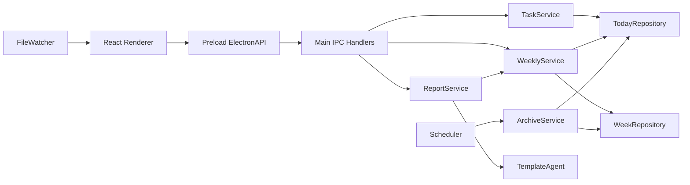

# 开发交接文档 — 悬浮便利贴 & 一键周报

| 项目         | 内容                                                   |
| ------------ | ------------------------------------------------------ |
| 文档版本     | v1.0                                                   |
| 交接日期     | 2026-08-13                                             |
| 当前应用版本 | `0.1.0` / 标签 `周记便利贴v1.0`                        |
| 当前主分支   | `main`                                                 |
| 当前 HEAD    | `e3c50b3 chore: move documents into documents folder`  |
| 技术栈       | Electron 37 + React 18 + TypeScript 5 + Tailwind CSS 3 |
| 支持目标     | macOS 11+、Windows 10+                                 |
| 产品状态     | v1.0 核心功能已实现，可继续迭代；正式分发准备尚未完成  |

---

## 1. 先读这里：5 分钟接手

### 1.1 项目位置

```text
/Users/nbcstone/Desktop/便利贴
```

### 1.2 必读文档顺序

1. 本文档。
2. [`产品需求文档-悬浮便利贴与一键周报-v3.1.md`](./产品需求文档-悬浮便利贴与一键周报-v3.1.md)。
3. [`开发设计文档-悬浮便利贴与一键周报-v1.0.md`](./开发设计文档-悬浮便利贴与一键周报-v1.0.md)。
4. [`AGENTS.md`](./AGENTS.md)。
5. 多 Agent 开发时再读 [`多Agent并行开发策略-v1.0.md`](./多Agent并行开发策略-v1.0.md)。

### 1.3 环境准备

推荐环境：

```text
Node.js: 22+（当前开发机器为 23.11.0）
pnpm: 11.19.0
npm: 10+
macOS: Apple Silicon 开发机
```

如果终端提示 `zsh: command not found: pnpm`，任选一种安装方式：

```bash
npm install -g pnpm@11.19.0
```

或：

```bash
corepack enable
corepack prepare pnpm@11.19.0 --activate
```

验证：

```bash
node --version
pnpm --version
```

### 1.4 第一次启动

```bash
cd "/Users/nbcstone/Desktop/便利贴"
pnpm install
pnpm dev
```

`pnpm dev` 会同时启动：

- Vite Renderer 开发服务器。
- Main/Preload 的 tsup watch 构建。
- Electron 应用。

命令会持续运行。停止开发应用时在终端按 `Control + C`。

### 1.5 开始修改前先跑基线

```bash
pnpm typecheck
pnpm lint
pnpm test
pnpm build
```

当前已知基线：

```text
TypeScript: 通过
ESLint: 通过
Vitest: 26 个测试文件、114 个测试通过
Renderer/Main/Preload 生产构建: 通过
```

如果 Codex 受限运行环境在执行 `pnpm <script>` 前错误地重建依赖，可直接运行项目锁定工具：

```bash
node_modules/.bin/tsc --noEmit
node_modules/.bin/eslint .
node_modules/.bin/vitest run
node_modules/.bin/vite build
node_modules/.bin/tsup
```

普通本机终端优先使用 `pnpm` 脚本。

---

## 2. 当前真实状态

### 2.1 已实现功能

- 今日任务添加、完成、撤销、内联编辑、删除。
- 完成时间记录为本地 `HH:mm`。
- 已完成区域折叠和展开。
- 菜单点击外部空白处或按 `Esc` 自动关闭。
- 历史日期查看、补录、编辑和删除完成事项。
- 当前周和历史周周记。
- 当前周实时合并今日尚未归档的完成事项。
- ISO 周、跨自然年周和周末处理。
- 每日 00:00 归档。
- 启动补偿、系统唤醒补偿、任务变更前补偿。
- 未完成任务跨日顺延。
- 外部 TXT 修改监听及 UI 刷新。
- 系统托盘、窗口关闭隐藏、单实例、置顶、窗口位置尺寸记忆。
- TemplateAgent 周报文本生成。
- 系统保存对话框导出 TXT。
- 导出后打开文件或在 Finder 中定位。
- 生产环境本地网络拦截。
- macOS arm64 未签名 `.app` 目录包构建和真实 GUI 冒烟。

### 2.2 最近一次修改

提交：

```text
69c0e09 fix: close note menu when clicking outside
```

行为：

- 点击右上角三个点打开菜单。
- 点击菜单以外空白区域自动关闭。
- 点击菜单内部不误关闭。
- 再次点击三个点仍可关闭。
- 按 `Esc` 可关闭。

实现位置：

```text
src/renderer/pages/FloatingNotePage.tsx
tests/renderer/floating-note-page.test.tsx
```

### 2.3 尚未完成或尚未充分验证

- 没有正式品牌图标，目前打包使用默认 Electron 图标。
- macOS 构建未签名、未公证。
- Windows 安装包尚未在 Windows 10/11 实机验证。
- 没有完整 Playwright Electron GUI E2E 脚手架。
- 托盘、系统保存对话框和多显示器行为仍需要 Windows 手工验收。
- 已实现独立设置窗口、便利贴颜色、60%–100% 整窗不透明度和本地诊断入口。
- 完成区域展开状态与置顶状态已接入统一设置持久化和多窗口同步。
- 当前只实现 `TemplateAgent`，没有 Ollama 或云端 Agent。
- 归档不做严格跨文件事务或任务 ID 幂等；这是 PRD 明确接受的取舍。

### 2.4 当前构建产物

```text
release/mac-arm64/悬浮便利贴.app
```

`release/` 被 `.gitignore` 忽略，不随 Git 提交。换一台机器后需要重新构建。

---

## 3. Git 与版本状态

### 3.1 当前远程

当前仓库已经配置：

```text
origin https://github.com/StoneNbc/-.git
```

当前 `main` 与 `origin/main` 一致。旧文档里“没有远程仓库”的说法已经过时。

规则：

- 本地开发不要求联网。
- `git commit` 只写本机。
- 只有 `git push` 才会上传到 GitHub。
- 未经项目所有者明确要求，不执行 push、创建 Release、修改远程分支或强制推送。

### 3.2 重要标签

```text
baseline/wave-0       工程初始化与共享契约
baseline/wave-1       文本/UI/平台基础
baseline/wave-2       业务服务、IPC、Watcher、调度
baseline/wave-3       周报导出与体验完善
周记便利贴v1.0        当前 v1.0 代码标签
```

### 3.3 开发分支建议

单人开发：

```bash
git switch main
git pull --ff-only
git switch -c feature/<功能名>
```

纯本地、不希望联网时：

```bash
git switch main
git switch -c feature/<功能名>
```

多个 Agent 并行时，按照多 Agent 策略使用短分支或 Worktree，避免多个写入 Agent 修改同一个 Checkout。

### 3.4 不要执行

- 不要在有用户未提交改动时运行 `git reset --hard`。
- 不要通过 `git checkout --` 覆盖不属于自己的改动。
- 不要强制推送 `main`。
- 不要提交 `data/`、`release/`、`dist/`、日志或用户导出的周报。

---

## 4. 工程结构

```text
便利贴/
├── documents/                     # PRD、开发设计、协作策略、交接文档
├── resources/                     # 默认配置等静态资源
├── src/
│   ├── main/                      # Electron 主进程
│   │   ├── agents/                # ReportAgent、TemplateAgent、工厂
│   │   ├── ipc/                   # IPC 通道、参数校验、Handler
│   │   ├── logging/               # 本地日志
│   │   ├── parsers/               # Today/Week 保真解析器
│   │   ├── platform/              # 路径、显示器、网络、Shell
│   │   ├── repositories/          # TXT 存储与原子写入
│   │   ├── services/              # 业务服务
│   │   ├── appLifecycle.ts        # 单实例与退出
│   │   ├── windowManager.ts       # 两类窗口
│   │   ├── trayManager.ts         # 系统托盘
│   │   ├── menuFactory.ts         # 桌面菜单
│   │   └── index.ts               # Main 组装入口
│   ├── preload/                   # contextBridge 白名单 API
│   ├── renderer/                  # React UI
│   └── shared/                    # 三层共享领域类型与纯函数
├── tests/
│   ├── integration/               # Repository/Service/IPC/平台集成测试
│   ├── renderer/                  # React 组件与页面测试
│   ├── unit/                      # 日期、Parser、Agent 测试
│   └── fixtures/                  # 文本样例
├── data/                          # 开发数据，不提交 Git
├── dist/                          # Renderer 构建产物，不提交 Git
├── dist-electron/                 # Main/Preload 构建产物，不提交 Git
├── release/                       # 安装/目录包，不提交 Git
├── package.json
├── pnpm-lock.yaml
├── vite.config.ts
├── tsup.config.ts
└── vitest.config.ts
```

---

## 5. 架构与进程边界



### 5.1 Main Process

入口：`src/main/index.ts`。

Main 负责：

- 文件系统。
- 窗口与托盘。
- 系统保存对话框。
- 定时任务和唤醒事件。
- 文件监听。
- 周报生成与写入。
- IPC 输入校验和错误转换。

### 5.2 Preload

契约：`src/preload/apiTypes.ts`。

实现：`src/preload/index.ts`。

原则：

- 只暴露明确方法。
- 不暴露通用 `ipcRenderer`。
- Renderer 不能提交任意文件路径。
- Renderer 不能直接访问 Node.js。

### 5.3 Renderer

入口：`src/renderer/main.tsx`。

页面路由：

```text
?view=note       悬浮便利贴
?view=weekly     周记窗口
```

Renderer 只通过 `window.electronAPI` 操作数据。

### 5.4 Shared

关键共享文件：

```text
src/shared/domain.ts
src/shared/results.ts
src/shared/dateUtils.ts
src/shared/validation.ts
src/main/ipc/channels.ts
src/main/ipc/schemas.ts
src/preload/apiTypes.ts
```

修改共享契约会影响 Main、Preload、Renderer 和测试，必须同步修改并运行全量门禁。

---

## 6. 不可破坏的业务规则

后续开发必须保持这些规则：

1. TXT 是任务数据的唯一事实来源，不引入另一个保存正文的数据库。
2. 允许内容和完成时间完全相同的重复任务。
3. 禁止按正文查找、去重、编辑或删除任务。
4. 当前任务定位使用 `revision + line`。
5. 外部修改导致 revision 变化时返回 `FILE_CHANGED`，不猜测目标任务。
6. 未知行不展示，但必须原样保留。
7. 未完成任务无限顺延，不记录创建日期。
8. 正常完成按实际勾选日期记录。
9. 历史补录按用户选择日期写入周文件。
10. 一周为 ISO 周一至周日，文件名使用 ISO week-year。
11. 零点归档先写周文件，成功后才重写 `today.txt`。
12. 不实现文本级归档去重。
13. 周报只写系统保存对话框选择的位置。
14. 不创建 `data/reports/` 副本。
15. 不记录“本周是否导出”。
16. 不实现周五导出提醒。
17. 默认不进行网络请求。
18. 关闭悬浮窗只隐藏，托盘“退出”才真正结束程序。

---

## 7. 数据文件

### 7.1 开发环境

```text
<项目根目录>/data/
├── today.txt
├── weeks/
├── config.json
└── logs/app.log
```

### 7.2 打包环境

macOS 当前路径：

```text
~/Library/Application Support/sticky-weekly/data/
```

通用规则来自：

```typescript
app.getPath('userData') / data;
```

### 7.3 测试覆盖路径

开发/测试可以使用：

```bash
STICKY_WEEKLY_DATA_DIR=/tmp/sticky-test-data NODE_ENV=development pnpm dev
```

只有非打包且 `NODE_ENV` 为 `development` 或 `test` 时才允许该覆盖，避免生产环境被任意环境变量改写数据目录。

### 7.4 Today 文件格式

```text
# 2026-08-13
- [ ] 准备周会材料
- [x] 回复客户邮件 @14:20
```

### 7.5 Week 文件格式

```text
# 第33周 (2026-08-10 ~ 2026-08-16)

## 周三 08-12
- 完成界面原型 @14:20
```

### 7.6 数据调试注意事项

- 开发应用和打包应用使用不同数据目录。
- UI 看不到手改内容时，先确认正在编辑哪一个 `today.txt`。
- 不要在调试中随意删除真实生产目录。
- 归档测试应使用临时目录和可注入 Clock，不要修改系统时间。

---

## 8. 核心模块说明

### 8.1 文本解析器

```text
src/main/parsers/lineEndings.ts
src/main/parsers/todayParser.ts
src/main/parsers/weekParser.ts
```

特性：

- UTF-8/BOM 容错。
- LF/CRLF 保留。
- 末尾换行保留。
- 合法节点和未知节点共同构成保真 AST。
- 未改节点直接输出原始 `raw`。

改 Parser 时必须同时运行：

```bash
pnpm test -- tests/unit/parser tests/integration/repositories
```

### 8.2 TextFileStore 与 Repository

```text
src/main/repositories/textFileStore.ts
src/main/repositories/todayRepository.ts
src/main/repositories/weekRepository.ts
```

特性：

- SHA-256 revision。
- 同路径串行写队列。
- `expectedRevision` 冲突检查。
- 同目录临时文件 + fsync + rename。
- 通过原始行号精确操作重复任务。

### 8.3 TaskService

文件：`src/main/services/taskService.ts`。

负责今日 CRUD。每次 mutation 前先调用：

```typescript
archiveService.reconcileToToday('before-mutation');
```

完成时间必须由 Main 的 Clock 生成，不能信任 Renderer 提交当前时间。

### 8.4 WeeklyService

文件：`src/main/services/weeklyService.ts`。

负责：

- 历史日期 CRUD。
- 指定周读取。
- 当前周合并 `today.txt` 中的已完成任务。

历史模式拒绝今天和未来日期。

### 8.5 ArchiveService

文件：`src/main/services/archiveService.ts`。

入口：

```typescript
reconcileToToday('startup' | 'midnight' | 'resume' | 'before-mutation');
```

固定顺序：

1. 读取 today。
2. 将完成任务写入对应 Week 文件。
3. 周写成功后重写 today。
4. 未完成任务顺延。
5. 未知行保留。

如果周写成功而 today 写失败，抛出 `ArchivePartialFailureError`，明确存在重复归档风险。

### 8.6 FileWatcherService

文件：`src/main/services/fileWatcher.ts`。

监听：

- `today.txt`
- `weeks/*.txt`
- `config.json`

忽略日志和临时文件。使用 revision + 时间窗口区分近期应用自身写入，但即使是自身写入也会广播标准事件给其他窗口。

### 8.7 Scheduler

文件：`src/main/services/scheduler.ts`。

- 启动时补偿。
- `0 0 * * *` 每日零点。
- `powerMonitor.resume` 唤醒补偿。
- 所有触发进入串行队列。

### 8.8 ReportService 与 Agent

```text
src/main/services/reportService.ts
src/main/agents/templateAgent.ts
src/main/agents/reportTemplate.ts
src/main/agents/agentFactory.ts
```

ReportService 流程：

1. WeeklyService 取数据。
2. AgentFactory 获取 Agent。
3. Agent 生成纯文本。
4. Main 打开保存对话框。
5. 只写用户选定路径。
6. 最近成功导出路径只保存在 Main 内存中。

新增 Agent 时实现共享 `ReportAgent`，不要在 Renderer 或 ReportService 内复制模板逻辑。

### 8.9 IPC

业务 Handler：

```text
src/main/ipc/registerHandlers.ts
src/main/ipc/reportHandlers.ts
```

通道契约：

```text
src/main/ipc/channels.ts
src/main/ipc/schemas.ts
src/preload/apiTypes.ts
```

所有输入必须经过 Zod 或等价严格校验。未知错误不把 stack 返回 Renderer。

### 8.10 Renderer 页面

```text
src/renderer/pages/FloatingNotePage.tsx
src/renderer/pages/WeeklyPage.tsx
```

状态规则：

- mutation 成功后只采用 Main 返回的 authoritative snapshot。
- 不在 React 中建立第二套任务事实来源。
- Watcher 事件使用 `useRefreshQueue` 合并风暴。
- `FILE_CHANGED` 时重新获取最新快照并提示用户重试。
- 列表 key 使用 `revision:line`，不使用正文。

---

## 9. 常见需求应该改哪里

| 需求                 | 主要文件                                               | 必补测试                      |
| -------------------- | ------------------------------------------------------ | ----------------------------- |
| 修改便利贴布局或菜单 | `FloatingNotePage.tsx`、相关 components、`globals.css` | `floating-note-page.test.tsx` |
| 修改任务项编辑行为   | `TaskItem.tsx`                                         | `task-components.test.tsx`    |
| 修改周记布局或切周   | `WeeklyPage.tsx`、`WeekNavigator.tsx`                  | `weekly-page.test.tsx`        |
| 修改 Today TXT 格式  | `todayParser.ts`、`todayRepository.ts`                 | Parser + Repository 测试      |
| 修改 Week TXT 格式   | `weekParser.ts`、`weekRepository.ts`                   | Parser + Repository 测试      |
| 修改任务业务规则     | `taskService.ts`                                       | `taskWeeklyService.test.ts`   |
| 修改历史/周聚合      | `weeklyService.ts`                                     | `taskWeeklyService.test.ts`   |
| 修改归档规则         | `archiveService.ts`、`scheduler.ts`                    | Archive + Scheduler 测试      |
| 修改文件监听         | `fileWatcher.ts`                                       | `fileWatcher.test.ts`         |
| 修改周报模板         | `reportTemplate.ts`、`templateAgent.ts`                | `templateAgent.test.ts`       |
| 修改导出流程         | `reportService.ts`、`reportHandlers.ts`                | Report 集成测试               |
| 新增 IPC             | channels + schemas + apiTypes + preload + handler      | IPC + Renderer 契约测试       |
| 修改窗口/托盘        | `windowManager.ts`、`trayManager.ts`、`menuFactory.ts` | Platform 测试 + 手工验证      |
| 修改数据目录         | `platform/paths.ts`                                    | `paths.test.ts`               |

---

## 10. 调试方法

### 10.1 Renderer 调试

开发模式运行：

```bash
pnpm dev
```

在 Electron 窗口中通过系统 View 菜单或快捷键打开 DevTools：

```text
macOS: Command + Option + I
Windows: Ctrl + Shift + I
```

重点查看：

- Console：React 错误和 rejected promise。
- Network：正常生产逻辑不应出现外部网络请求。
- Elements：菜单层级、焦点与 aria 属性。

### 10.2 Main/Preload 调试

Main 的标准输出会出现在运行 `pnpm dev` 的终端中。

本地日志：

```text
开发：<项目>/data/logs/app.log
打包：~/Library/Application Support/sticky-weekly/data/logs/app.log
```

查看日志：

```bash
tail -f data/logs/app.log
```

### 10.3 数据调试

```bash
sed -n '1,120p' data/today.txt
find data/weeks -maxdepth 1 -type f -print
```

外部编辑 TXT 后，Watcher 应在约 180 ms 防抖和文件稳定等待后刷新 UI。

### 10.4 归档调试

不要等待真实零点。通过测试注入 Clock：

```bash
pnpm test -- tests/integration/services/archiveService.test.ts
```

### 10.5 菜单外部点击调试

当前实现位于 `FloatingNotePage.tsx` 的 document-level `pointerdown` 和 `keydown` effect。

外部点击判断排除：

```text
#floating-note-menu
[aria-controls="floating-note-menu"]
```

如果以后重命名菜单 ID 或修改 TitleBar 的 `aria-controls`，必须同步修改该逻辑和测试。

---

## 11. 测试策略

### 11.1 全量门禁

提交前至少运行：

```bash
pnpm typecheck
pnpm lint
pnpm test
pnpm build
```

### 11.2 测试目录

```text
tests/unit/date                 ISO 周和日期
tests/unit/parser               TXT 解析与保真
tests/unit/agents               TemplateAgent
tests/integration/repositories  原子写入、revision、重复任务
tests/integration/services      CRUD、周聚合、归档
tests/integration/ipc           IPC 校验与错误映射
tests/integration/watcher       外部文件变化
tests/integration/scheduler     零点/启动/唤醒触发
tests/integration/report        报告保存、IPC、网络策略
tests/integration/platform      生命周期、配置、路径、显示器、日志
tests/renderer                  页面、组件、Reducer、Mock 契约
```

### 11.3 改功能必须补测试

- 修复 bug：先补能复现 bug 的测试，再改实现。
- 修改共享契约：必须运行全量测试。
- 修改 Parser/Repository：检查未知行、重复行和 CRLF。
- 修改 UI：至少补 Renderer Testing Library 测试。
- 修改窗口/托盘/保存对话框：自动测试之外还要做平台手工冒烟。

### 11.4 当前没有的测试

当前没有完整 Electron Playwright E2E。若下一阶段经常修改窗口、托盘、系统对话框或多屏行为，建议优先搭建。

---

## 12. 构建与打包

### 12.1 生产构建

```bash
pnpm build
```

输出：

```text
dist/             Renderer
dist-electron/    Main + Preload
```

### 12.2 macOS 目录包

Apple Silicon：

```bash
pnpm build
node_modules/.bin/electron-builder --dir --mac --arm64
```

输出：

```text
release/mac-arm64/悬浮便利贴.app
```

### 12.3 macOS 分发包

```bash
pnpm dist
```

正式分发前必须：

- 增加正式 `.icns` 图标。
- 配置 Apple Developer ID。
- 签名。
- Notarization。
- 在干净 macOS 用户环境验证安装与首次启动。

### 12.4 Windows

配置目标为 NSIS。应在 Windows 环境执行：

```bash
pnpm install --frozen-lockfile
pnpm build
pnpm dist
```

发布前验证：

- 托盘图标与菜单。
- 关闭隐藏。
- 单实例。
- 文件占用时的原子替换。
- 保存对话框。
- 多显示器窗口恢复。
- Windows 代码签名与 SmartScreen。

---

## 13. 安全边界

- `contextIsolation: true`。
- `nodeIntegration: false`。
- `sandbox: true`。
- 不暴露通用 `ipcRenderer`。
- Renderer 不接收任意文件系统能力。
- 保存路径只能来自 Main 的系统保存对话框。
- 打开/定位文件只针对 Main 内存中最近一次成功导出路径。
- Renderer 新窗口和外部导航被阻止。
- 生产网络策略阻止 HTTP/HTTPS/WebSocket。
- 开发环境只允许配置的本地 Vite origin。

任何需要关闭 sandbox、开放网络或新增任意路径 IPC 的修改，都属于高风险架构变更，必须单独评审并补安全测试。

---

## 14. 已知风险和技术债

### 14.1 归档跨文件非事务

周文件和 Today 文件无法作为一个原子事务写入。当前策略优先防止完成事项丢失：先写 Week，再写 Today。极端失败可能造成下次重复归档。

不要通过文本去重“修复”这个问题，否则会误删用户合法的重复任务。

### 14.2 无持久化任务 ID

任务使用 revision + line 精确定位。外部修改后旧操作被拒绝，用户需刷新后重试。这是设计选择。

### 14.3 Watcher 自身写判断

当前使用 revision + 2 秒窗口识别自身写入。ArchiveService 没有返回目标 Week revision，因此某些归档周文件事件可能被标为 `external-edit`，但仍只触发刷新，不形成写入循环。

### 14.4 Electron 资源占用

PRD 的空闲内存低于 100 MB 是偏严格目标。尚未形成正式性能基准报告。

### 14.5 打包身份

当前应用 ID 为：

```text
com.local.stickyweekly
```

正式发布前可能需要改为组织拥有的反向域名。改变 appId 可能导致系统把新版视为另一应用，数据目录和签名策略需要一并评估。

### 14.6 远程仓库命名

当前远程 URL 末尾仓库名为 `-`，可用但可读性差。若要重命名 GitHub 仓库，需要同步更新 `origin`，但不要在没有项目所有者授权时自行修改。

---

## 15. 推荐下一步

按优先级建议：

### P0：建立可发布基础

1. 设计正式应用图标和托盘图标。
2. 明确正式 appId、产品名和版本号。
3. 配置 macOS 签名与公证。
4. 在 Windows 10/11 实机完成 NSIS 构建和验收。

### P1：补 GUI 自动化

1. 引入 Playwright Electron E2E。
2. 覆盖启动、任务 CRUD、关闭隐藏、周记打开。
3. 覆盖最小 280 × 280 尺寸无严重溢出。
4. 对保存对话框使用适配层测试，不在 CI 依赖真实系统交互。

### P2：设置页和体验

1. [已完成] 实现设置窗口。
2. [已完成] 完成展开状态持久化。
3. [已完成] 增加日志/数据目录诊断入口。
4. 完善打开文件失败时 Renderer 反馈。

### P3：Agent 扩展

1. 优先实现本地 OllamaAgent。
2. 网络能力必须默认关闭并明确由用户启用。
3. 保持 ReportAgent 接口和导出流程不变。
4. 云端 Agent 必须明确隐私提示和网络边界。

---

## 16. 新开发者第一天建议任务

1. 在新分支运行全量基线。
2. 用 `pnpm dev` 启动应用。
3. 添加两条同名任务，完成其中一条，确认另一条不受影响。
4. 外部编辑开发目录的 `data/today.txt`，确认 UI 自动刷新。
5. 进入昨天补录一条完成事项。
6. 打开周记并确认当天/历史数据。
7. 导出一个 TXT，确认只出现在选择位置。
8. 阅读对应测试，建立对模块边界的直觉。

完成这些步骤后再开始功能开发。

---

## 17. 交付前检查清单

- [ ] 工作区没有不明用户改动。
- [ ] 新需求符合 PRD，或已同步更新 PRD。
- [ ] 没有破坏重复任务和未知行保留。
- [ ] 没有让 Renderer 直接访问文件系统。
- [ ] IPC 输入已校验。
- [ ] 修复或功能有回归测试。
- [ ] TypeScript 通过。
- [ ] ESLint 通过。
- [ ] 全量 Vitest 通过。
- [ ] 生产构建通过。
- [ ] 涉及桌面能力时完成手工冒烟。
- [ ] 未提交 `data/`、`release/`、日志或用户报告。
- [ ] 未经明确授权不执行 `git push`。

---

## 18. 出问题时的快速定位

| 症状                       | 优先检查                                                  |
| -------------------------- | --------------------------------------------------------- |
| `pnpm` 找不到              | 安装 pnpm 11.19 或启用 Corepack                           |
| 页面打开但任务为空         | 当前运行的是开发还是打包应用；检查对应 data 目录          |
| 点击任务提示文件已变化     | TXT 被外部修改；刷新后重试，这是正常冲突保护              |
| 零点后未归档               | `data/logs/app.log`、Scheduler 启动日志、Today 日期头     |
| 周记缺少今天完成项         | Today 文件日期、任务 `[x]`、WeeklyService 当前 ISO 周判断 |
| 历史补录失败               | 不能补录今天或未来；检查日期是否合法                      |
| 外部改 TXT 不刷新          | FileWatcher 日志、文件路径、是否为合法 week 文件名        |
| 导出没有文件               | 是否取消保存；查看 ReportService 日志和 Renderer toast    |
| 打开导出文件提示 NOT_FOUND | 当前进程尚未成功导出；最近路径只保存在内存                |
| 关闭窗口后应用仍运行       | 设计行为；从托盘选择退出                                  |
| `.app` 首次打不开          | 当前未签名；开发机右键打开或在隐私与安全中允许            |
| 打包仍是旧界面             | 先 `pnpm build`，再重新运行 electron-builder              |

---

## 19. 交接结论

当前代码不是原型空壳，而是一套已有完整文本内核、业务服务、React UI、Electron 平台集成和自动测试的 v1.0 实现。下一位开发者应基于现有分层继续迭代，不要重建工程或绕过现有 Repository/Service/IPC 边界。

最重要的三个原则：

1. TXT 保真和重复任务语义不能破坏。
2. Renderer 永远通过冻结的 ElectronAPI 访问 Main。
3. 每次变更用自动测试和真实桌面冒烟共同证明。
