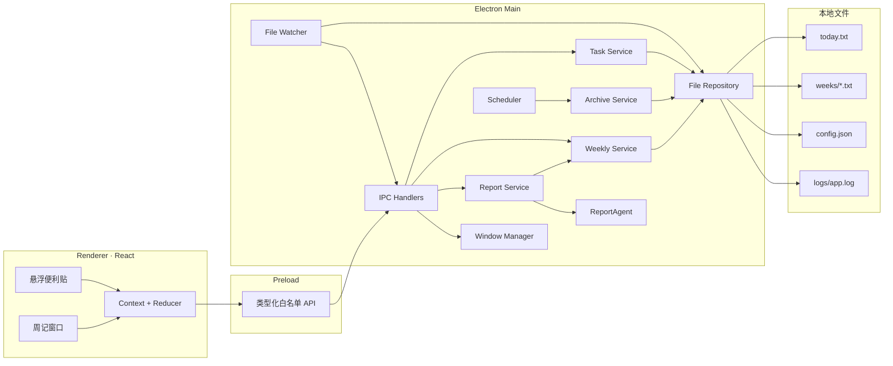

# 开发设计文档 — 悬浮便利贴 & 一键周报

| 项目 | 内容 |
| --- | --- |
| 文档版本 | v1.0 |
| 日期 | 2026-08-13 |
| 对应 PRD | 《产品需求文档-悬浮便利贴与一键周报-v3.1》 |
| 目标版本 | 应用 v1.0 |
| 状态 | 开发设计定稿 |

---

## 1. 文档目的

本文档将 PRD v3.1 转换为可实施的工程方案，作为项目初始化、编码、测试、打包和验收的统一技术依据。

本文档重点解决以下问题：

- Electron 主进程、Preload 与 React 渲染进程如何分工。
- 如何解析并修改用户可直接编辑的 TXT，同时保留未知行。
- 在不引入持久化任务 ID、允许重复任务的前提下，如何准确操作某一行。
- 如何实现每日 00:00 归档、启动补偿与系统唤醒补偿。
- 如何读取和修改历史周文件。
- 如何统一当前周展示和周报导出数据。
- 如何保证文件操作、IPC 和桌面窗口行为安全可靠。

若本文档与 PRD 冲突，以 PRD v3.1 的产品行为为准；实现前应同步修订本文档中的技术方案。

---

## 2. 设计原则

### 2.1 本地优先

- v1.0 不发起任何网络请求。
- 任务和配置只存储在本机应用数据目录。
- 周报只写入用户在系统保存对话框中选择的位置。
- 不创建周报内部副本，不追踪导出状态。

### 2.2 文本为事实来源

- `today.txt` 与 `weeks/*.txt` 是任务数据的唯一事实来源。
- React 状态只作为界面缓存，不能成为独立数据源。
- 不使用数据库，不创建保存任务正文的旁路索引。
- 用户在外部编辑 TXT 后，应用重新解析并刷新界面。

### 2.3 保真修改

- 解析器必须生成包含已识别节点和原始节点的文档模型。
- 无法识别的行不展示为任务，但必须保留原始文本、顺序和换行。
- 常规增删改只修改目标节点，不重建整个文件的语义内容。
- 新建的标准行统一使用 LF；读取时识别原文件换行风格，写回时优先沿用原风格。

### 2.4 单实例、串行写入

- 应用只允许一个主进程实例。
- 同一路径的写操作进入同一串行队列。
- 写入采用“临时文件 → fsync（平台允许时）→ 原子替换”。
- 归档涉及两个文件，采用固定写入顺序并记录失败日志，但 v1.0 不承诺跨文件事务与严格幂等。

### 2.5 最小权限

- 渲染进程关闭 Node 集成并启用上下文隔离。
- 渲染进程只能调用 Preload 暴露的白名单 API。
- 业务 IPC 不接受任意文件路径。
- 唯一允许用户选择的报告路径必须由主进程保存对话框返回。

---

## 3. 技术选型

### 3.1 核心技术

| 领域 | 方案 | 用途 |
| --- | --- | --- |
| 桌面运行时 | Electron | 窗口、托盘、菜单、文件对话框、系统事件 |
| UI | React 18 + TypeScript | 悬浮窗与周记窗口 |
| 样式 | Tailwind CSS | 便利贴视觉和响应式布局 |
| 构建 | Vite | 渲染进程构建与开发热更新 |
| 状态 | React Context + `useReducer` | 页面状态与异步操作状态 |
| 文件系统 | Node.js `fs/promises` + fs-extra | 目录管理、读取、原子替换辅助 |
| 定时 | node-cron | 每日零点调度 |
| 日期 | date-fns + date-fns-tz 或等价本地日期库 | ISO 周、格式化与日期运算 |
| 文件监听 | chokidar | 跨平台文件变化监听与防抖 |
| 日志 | electron-log 或轻量封装 | 本地滚动日志 |
| 数据校验 | zod | IPC 参数和配置文件校验 |
| 单元测试 | Vitest | 解析器、日期、归档、模板测试 |
| 组件测试 | React Testing Library | 关键交互测试 |
| E2E | Playwright Electron 支持 | 窗口、IPC、文件落盘流程测试 |
| 打包 | electron-builder | macOS 与 Windows 安装包 |

依赖的确切版本在项目初始化时锁定到 `package-lock.json` 或 `pnpm-lock.yaml`。业务代码不得依赖未锁定的浮动版本。

### 3.2 建议项目工具

- 包管理器：pnpm。
- 代码检查：ESLint。
- 格式化：Prettier。
- Git 提交前检查：lint-staged + simple-git-hooks（可选）。
- TypeScript 开启 `strict`、`noUncheckedIndexedAccess` 和 `exactOptionalPropertyTypes`。

---

## 4. 总体架构



### 4.1 进程职责

#### 主进程

- 拥有全部文件系统权限和业务数据访问权。
- 创建窗口、托盘、系统菜单和保存对话框。
- 运行归档调度、文件监听和报告生成。
- 校验全部 IPC 输入。
- 负责将文件变化事件广播给渲染进程。

#### Preload

- 将 `ipcRenderer.invoke/on` 包装为有限、类型明确的接口。
- 不暴露 `ipcRenderer`、文件系统或通用通道调用能力。
- 对事件监听提供取消订阅函数。

#### 渲染进程

- 负责展示、输入和交互反馈。
- 不直接读写磁盘。
- 每次成功变更后以主进程返回的数据更新界面。
- 收到文件变化事件后重新拉取当前视图数据。

---

## 5. 项目目录设计

```text
sticky-weekly/
├── build/
│   ├── icon.icns
│   ├── icon.ico
│   └── trayTemplate.png
├── resources/
│   └── default-config.json
├── src/
│   ├── main/
│   │   ├── index.ts
│   │   ├── appLifecycle.ts
│   │   ├── windowManager.ts
│   │   ├── trayManager.ts
│   │   ├── menuFactory.ts
│   │   ├── ipc/
│   │   │   ├── channels.ts
│   │   │   ├── schemas.ts
│   │   │   └── registerHandlers.ts
│   │   ├── services/
│   │   │   ├── taskService.ts
│   │   │   ├── weeklyService.ts
│   │   │   ├── archiveService.ts
│   │   │   ├── reportService.ts
│   │   │   ├── scheduler.ts
│   │   │   ├── fileWatcher.ts
│   │   │   └── configService.ts
│   │   ├── repositories/
│   │   │   ├── todayRepository.ts
│   │   │   ├── weekRepository.ts
│   │   │   └── textFileStore.ts
│   │   ├── parsers/
│   │   │   ├── todayParser.ts
│   │   │   ├── weekParser.ts
│   │   │   └── lineEndings.ts
│   │   ├── agents/
│   │   │   ├── types.ts
│   │   │   ├── agentFactory.ts
│   │   │   ├── templateAgent.ts
│   │   │   └── reportTemplate.ts
│   │   ├── platform/
│   │   │   ├── paths.ts
│   │   │   ├── shellActions.ts
│   │   │   └── displayBounds.ts
│   │   └── logging/
│   │       └── logger.ts
│   ├── preload/
│   │   ├── index.ts
│   │   └── apiTypes.ts
│   ├── renderer/
│   │   ├── index.html
│   │   ├── main.tsx
│   │   ├── AppRouter.tsx
│   │   ├── pages/
│   │   │   ├── FloatingNotePage.tsx
│   │   │   └── WeeklyPage.tsx
│   │   ├── components/
│   │   │   ├── TitleBar.tsx
│   │   │   ├── TaskList.tsx
│   │   │   ├── TaskItem.tsx
│   │   │   ├── CompletedSection.tsx
│   │   │   ├── AddTaskInput.tsx
│   │   │   ├── HistoricalInput.tsx
│   │   │   ├── WeekNavigator.tsx
│   │   │   ├── DaySection.tsx
│   │   │   └── ExportResultToast.tsx
│   │   ├── state/
│   │   │   ├── noteReducer.ts
│   │   │   ├── weeklyReducer.ts
│   │   │   └── providers.tsx
│   │   ├── hooks/
│   │   │   ├── useElectronEvents.ts
│   │   │   ├── useInlineEdit.ts
│   │   │   └── useKeyboardShortcuts.ts
│   │   ├── styles/
│   │   │   └── globals.css
│   │   └── types/
│   │       └── global.d.ts
│   └── shared/
│       ├── domain.ts
│       ├── results.ts
│       ├── dateUtils.ts
│       ├── validation.ts
│       └── constants.ts
├── tests/
│   ├── unit/
│   ├── integration/
│   ├── renderer/
│   ├── e2e/
│   └── fixtures/
├── electron-builder.yml
├── vite.config.ts
├── tsconfig.json
├── package.json
└── README.md
```

---

## 6. 运行时数据目录

### 6.1 路径规则

- 生产环境根目录：`app.getPath('userData')/data/`。
- 开发环境默认根目录：项目根目录下 `data/`。
- 自动化测试：每个测试使用独立临时目录。
- 可通过仅限开发与测试环境的环境变量覆盖数据目录；生产构建忽略该变量。

### 6.2 初始目录

```text
data/
├── today.txt
├── weeks/
├── config.json
└── logs/
    └── app.log
```

首次启动时：

1. 创建 `data/`、`weeks/` 和 `logs/`。
2. 若 `today.txt` 不存在，写入 `# 当天日期` 和结尾换行。
3. 若 `config.json` 不存在，写入默认配置。
4. 不预先创建空周文件；首次归档或历史补录时再创建。
5. 不创建 `reports/`。

---

## 7. 领域模型

### 7.1 渲染层只读模型

```typescript
export type FileRevision = string;

export interface TaskLocator {
  line: number;          // 0-based，指向本次文件快照中的原始行
  revision: FileRevision;
}

export interface TodayTaskView {
  locator: TaskLocator;
  content: string;
  completed: boolean;
  completedAt?: string;  // HH:mm
}

export interface HistoricalTaskView {
  locator: TaskLocator;
  date: string;          // YYYY-MM-DD
  content: string;
  completedAt?: string;
}

export interface TodaySnapshot {
  fileDate: string;
  currentDate: string;
  revision: FileRevision;
  tasks: TodayTaskView[];
  warnings: ParseWarning[];
}

export interface DayRecordSnapshot {
  date: string;
  revision: FileRevision;
  tasks: HistoricalTaskView[];
  warnings: ParseWarning[];
}

export interface WeeklyTask {
  date: string;
  content: string;
  time?: string;
}

export interface WeeklySnapshot {
  isoYear: number;
  isoWeek: number;
  weekStart: string;
  weekEnd: string;
  revision: FileRevision | null;
  groups: Array<{
    date: string;
    weekdayLabel: string;
    tasks: WeeklyTask[];
  }>;
  total: number;
}
```

### 7.2 为什么使用临时定位器

PRD 明确不使用持久化任务 ID，并允许完全相同的任务重复存在，因此不能使用内容作为删除、编辑或切换完成状态的依据。

每次读取文件时，主进程计算：

- `revision`：文件原始字节内容的 SHA-256 或等价快速摘要。
- `line`：任务在该快照中的原始行号。

渲染进程提交变更时必须携带两者。主进程在写入前重新读取文件：

- 若 revision 一致，则按行号操作准确的那一条记录。
- 若 revision 不一致，返回 `FILE_CHANGED`，不做写入；渲染进程刷新后提示“数据文件已更新，请重试”。

定位器只在内存和 IPC 中存在，不写入业务文件，因此不违反纯文本设计和无任务 ID 约束。

### 7.3 文件 AST

解析器内部使用保真节点模型：

```typescript
type TodayNode =
  | { kind: 'header'; raw: string; date: string; line: number }
  | {
      kind: 'task';
      raw: string;
      line: number;
      completed: boolean;
      content: string;
      completedAt?: string;
    }
  | { kind: 'blank'; raw: string; line: number }
  | { kind: 'unknown'; raw: string; line: number; reason: string };

type WeekNode =
  | { kind: 'weekHeader'; raw: string; line: number; isoWeek?: number }
  | { kind: 'dayHeader'; raw: string; line: number; date: string }
  | {
      kind: 'archivedTask';
      raw: string;
      line: number;
      date: string;
      content: string;
      completedAt?: string;
    }
  | { kind: 'blank'; raw: string; line: number }
  | { kind: 'unknown'; raw: string; line: number; reason: string };
```

序列化时：

- 未发生变化的节点直接输出 `raw`。
- 新增或被修改的标准节点按规范格式输出。
- 删除只删除目标节点。
- 未知节点始终原样输出。

---

## 8. 文本格式与解析规则

### 8.1 通用规则

- 文件编码：UTF-8，无 BOM；读取时若发现 BOM，可容错移除并记录警告，下一次写回不再输出 BOM。
- 识别 `LF` 与 `CRLF`；写回时沿用文件首次检测到的主要换行符。
- 单个任务内容不允许真实换行；UI 输入中的换行替换为空格。
- 内容保存前只移除首尾空白，不压缩中间空格。
- 空任务无效。
- `@HH:MM` 是任务行末尾的保留时间语法。只有满足合法 24 小时格式的末尾标记才解析为完成时间。
- 用户希望正文以相同模式结尾时，v1.0 会将其解释为时间；UI 应在输入历史时间与正文时分离字段，降低歧义。

### 8.2 `today.txt` 解析

标准格式：

```text
# 2026-08-13
- [ ] 准备周会材料
- [x] 回复客户邮件 @14:20
```

建议正则：

```typescript
const HEADER_RE = /^# (\d{4}-\d{2}-\d{2})$/;
const TASK_RE = /^- \[([ xX])\] (.+)$/;
const TRAILING_TIME_RE = /\s@([01]\d|2[0-3]):([0-5]\d)$/;
```

处理规则：

- 第一条合法日期头作为文件日期。
- 不在第一行的日期头视为未知行并记录警告。
- `[x]` 与 `[X]` 均可读取；应用修改后规范化为 `[x]`。
- 未完成行末尾即使存在合法 `@HH:MM`，也不作为完成时间；整行可标为格式警告但原样保留，避免自动改写用户内容。
- 已完成行可不带时间，读取为 `completedAt: undefined`。
- 重复行分别生成不同的行定位器。

### 8.3 周文件解析

标准格式：

```text
# 第33周 (2026-08-10 ~ 2026-08-16)

## 周一 08-10
- 完成界面原型 @14:20
```

建议正则：

```typescript
const WEEK_HEADER_RE = /^# 第(\d{1,2})周 \((\d{4}-\d{2}-\d{2}) ~ (\d{4}-\d{2}-\d{2})\)$/;
const DAY_HEADER_RE = /^## (周[一二三四五六日]) (\d{2})-(\d{2})$/;
const ARCHIVED_TASK_RE = /^- (.+)$/;
```

解析日期时不能仅依靠 `MM-DD`：必须结合文件名的 ISO week-year 和目标 ISO 周，验证该日期确实位于该周范围内。

规则：

- 任务归属于它上方最近的合法日期标题。
- 没有合法日期标题的 `- ...` 行视为未知行，不展示、不移动。
- 日期标题与实际星期不一致时记录警告，并以 ISO 日期计算结果为准；v1.0 不自动修复原行。
- 重复日期段允许读取；展示时合并为同一日期组，但编辑时仍按原始行定位。
- 新增历史记录时优先追加到第一个合法日期段末尾；不存在时按日期顺序创建新段。
- 删除某日期最后一个可识别任务后，仅当该日期段中没有未知非空内容时才删除标题和相邻多余空行；否则保留标题。

### 8.4 未知行警告

```typescript
export interface ParseWarning {
  file: string;
  line: number;      // 对用户展示时转换为 1-based
  code:
    | 'UNKNOWN_LINE'
    | 'INVALID_HEADER'
    | 'INVALID_DATE'
    | 'ORPHAN_TASK'
    | 'INVALID_TIME'
    | 'DUPLICATE_HEADER';
  reason: string;
}
```

- 每次解析都可以返回警告，但 UI v1.0 不必展示完整诊断面板。
- 日志按“文件路径 + revision + 行号 + code”做会话级节流，避免文件监听反复记录相同警告。
- 日志不得省略原始文件路径和行号，但正文内容可截断，避免日志无限膨胀。

---

## 9. 文件存储与写入策略

### 9.1 TextFileStore 接口

```typescript
interface TextFileSnapshot {
  path: string;
  text: string;
  revision: string;
  eol: '\n' | '\r\n';
  endsWithEol: boolean;
}

interface TextFileStore {
  read(path: string): Promise<TextFileSnapshot>;
  writeAtomic(path: string, text: string): Promise<TextFileSnapshot>;
  update<T>(
    path: string,
    expectedRevision: string | null,
    transform: (snapshot: TextFileSnapshot) => Promise<{ text: string; result: T }>
  ): Promise<{ snapshot: TextFileSnapshot; result: T }>;
}
```

### 9.2 写队列

- 使用规范化绝对路径作为队列键。
- 同一路径的读取-校验-修改-写入操作必须在同一队列任务内完成。
- 不同周文件可以并行，但归档服务应主动串行化完整归档流程。
- 写入成功后记录该路径的新 revision 和时间戳，供 Watcher 判断应用自身写入。

### 9.3 原子写入

1. 确保目标父目录存在。
2. 在目标同目录创建唯一临时文件，例如 `.today.txt.<pid>.<nonce>.tmp`。
3. 使用 UTF-8 写入完整内容。
4. 尽可能刷新文件句柄。
5. 将临时文件重命名替换目标文件。
6. Windows 上若目标替换失败，使用受控的替换策略重试。
7. 失败时清理本次临时文件并保留原文件。

临时文件必须与目标位于同一文件系统，才能最大概率保证重命名原子性。

### 9.4 冲突响应

```typescript
type MutationResult<T> =
  | { ok: true; data: T }
  | { ok: false; code: 'FILE_CHANGED'; message: string }
  | { ok: false; code: 'NOT_FOUND'; message: string }
  | { ok: false; code: 'INVALID_INPUT'; message: string }
  | { ok: false; code: 'IO_ERROR'; message: string };
```

发生 `FILE_CHANGED` 时不得猜测目标任务，也不得按内容匹配重复任务。界面刷新后由用户重新执行操作。

---

## 10. 核心服务设计

### 10.1 TaskService

职责：

- 获取今日快照。
- 添加今日未完成任务。
- 完成、撤销、编辑和删除今日任务。
- 在每次今日写操作前执行轻量日期检查；若文件日期落后，先调用 ArchiveService 补偿。

关键接口：

```typescript
interface TaskService {
  getToday(): Promise<TodaySnapshot>;
  addTodayTask(content: string): Promise<TodaySnapshot>;
  toggleTodayTask(locator: TaskLocator): Promise<MutationResult<TodaySnapshot>>;
  editTodayTask(
    locator: TaskLocator,
    content: string,
    completedAt?: string
  ): Promise<MutationResult<TodaySnapshot>>;
  deleteTodayTask(locator: TaskLocator): Promise<MutationResult<TodaySnapshot>>;
}
```

完成任务时由主进程读取当前本地时间，渲染进程不能自行提交完成日期和当前时间。

### 10.2 WeeklyService

职责：

- 获取历史日期记录。
- 新增、编辑、删除历史完成记录。
- 获取指定 ISO 周聚合数据。
- 当前周读取周文件后，追加 `today.txt` 中今天尚未归档的已完成任务。
- 不对相同内容去重。

关键接口：

```typescript
interface WeeklyService {
  getDay(date: string): Promise<DayRecordSnapshot>;
  addHistoricalTask(input: {
    date: string;
    content: string;
    completedAt?: string;
  }): Promise<DayRecordSnapshot>;
  editHistoricalTask(input: {
    date: string;
    locator: TaskLocator;
    content: string;
    completedAt?: string;
  }): Promise<MutationResult<DayRecordSnapshot>>;
  deleteHistoricalTask(input: {
    date: string;
    locator: TaskLocator;
  }): Promise<MutationResult<DayRecordSnapshot>>;
  getWeek(isoYear: number, isoWeek: number): Promise<WeeklySnapshot>;
}
```

当前周合并规则：

- 先读取周文件中的全部已归档任务。
- 仅当 `today.txt` 文件日期属于请求周时，加入其中的 `[x]` 任务。
- 顺序为：按日期升序；同一天先显示周文件任务，再显示今日文件任务；各自保持文件顺序。
- 不做内容级去重。

### 10.3 ArchiveService

职责：

- 检查 `today.txt` 文件日期是否早于本地今天。
- 将该文件日期的完成事项归档至对应周文件。
- 将未完成事项顺延，并把日期头更新为今天。
- 为启动、零点、唤醒和今日写操作提供同一入口。

接口：

```typescript
interface ArchiveResult {
  status: 'noop' | 'rolled-over' | 'archived';
  sourceDate: string;
  targetDate: string;
  archivedCount: number;
  carriedCount: number;
}

interface ArchiveService {
  reconcileToToday(trigger: 'startup' | 'midnight' | 'resume' | 'before-mutation'):
    Promise<ArchiveResult>;
}
```

详细流程见第 12 章。

### 10.4 ReportService

职责：

- 读取指定周的统一 `WeeklySnapshot`。
- 将任务转换为 Agent 输入。
- 调用 AgentFactory 获取 Agent。
- 弹出保存对话框。
- 仅向用户选择的位置写入报告。
- 返回打开文件与打开所在目录所需的安全结果。

```typescript
type ExportReportResult =
  | { status: 'cancelled' }
  | { status: 'saved'; path: string }
  | { status: 'failed'; message: string };
```

### 10.5 ConfigService

- 使用 zod 校验配置。
- 缺失字段使用默认值。
- 未知字段读取时保留，写回时不主动删除，为未来配置扩展留空间。
- 窗口尺寸写入做 300–1000 px 等合理范围约束。
- 写窗口位置前进行节流，避免拖动过程中频繁落盘。

---

## 11. 今日任务操作流程

### 11.1 添加

1. Renderer 提交去除首尾空格后的正文。
2. Main 校验长度、空值和换行。
3. ArchiveService 执行 `reconcileToToday('before-mutation')`。
4. TodayRepository 读取最新快照。
5. 在最后一个今日任务后追加 `- [ ] 内容`；若不存在任务，则在日期头后追加。
6. 未知行保持原位置。若文件尾部存在未知块，新任务默认追加到最后一个已识别任务之后，而非文件绝对末尾。
7. 原子写入并返回新 TodaySnapshot。

### 11.2 完成/撤销

1. Renderer 提交 TaskLocator。
2. Main 检查 revision。
3. 验证 line 指向合法任务。
4. 未完成 → 完成：改为 `[x]`，完成时间由主进程生成。
5. 完成 → 未完成：改为 `[ ]`，移除已解析的末尾时间标记。
6. 写入并返回新快照。

### 11.3 编辑

- 今日未完成项只编辑正文。
- 今日已完成项默认保留原时间。
- 若 UI 后续允许直接编辑时间，必须作为独立字段提交并做 `HH:mm` 校验。
- 不允许正文包含换行。
- 若 revision 已变化，拒绝写入并刷新。

### 11.4 删除

- 删除目标任务节点及其行终止符。
- 不弹确认，不保留回收记录。
- 不自动清理目标附近的未知行。
- 可清理因删除产生的连续三个以上空行，使标准区域最多保留两个空行；未知空白是否压缩应保守处理，首版建议不压缩用户已有空白。

---

## 12. 零点归档与跨日补偿

### 12.1 触发源

- 应用启动并完成数据目录初始化后。
- node-cron 每日 `0 0 * * *`。
- Electron `powerMonitor` 的 `resume` 事件。
- 任何今日任务写操作前的轻量日期检查。
- 可增加低频保险检查，例如每 30 分钟检查一次日期，但不替代零点 cron。

### 12.2 日期判断

设：

- `fileDate`：`today.txt` 合法头部日期。
- `localToday`：操作系统本地今天。

规则：

- `fileDate === localToday`：不归档。
- `fileDate < localToday`：执行跨日归档和顺延。
- `fileDate > localToday`：视为系统时间回退或用户手工编辑异常；不自动将未来任务归档到过去，记录错误并向 UI 返回可恢复提示。
- 无合法头部：保留原文件，尝试在顶部插入今天的标准头部，同时将原非法头部保留为未知行；记录高优先级日志。

### 12.3 归档算法

```text
archiveMutex.lock
  读取 today.txt 最新快照
  如果文件日期未落后：结束

  解析 completedTasks、pendingTasks、unknownNodes
  根据 fileDate 计算 ISO week-year、week number、周一和周日

  如果 completedTasks 非空：
    读取或创建目标 week 文件
    确保 fileDate 日期段存在
    按 today.txt 中的顺序逐条追加完成任务
    原子写入 week 文件

  重新构造 today 文档：
    日期头改为 localToday
    删除已完成任务节点
    保留未完成任务节点
    保留未知节点
  原子写入 today.txt

  广播 today-changed 与 week-changed
archiveMutex.unlock
```

### 12.4 固定写入顺序及风险

跨文件事务顺序固定为：

1. 先写周文件。
2. 周文件成功后再写 `today.txt`。

理由：优先避免完成事项丢失。如果周文件成功而 `today.txt` 写入失败，下次补偿可能再次归档并产生重复。这符合 PRD 对“不做归档幂等、接受极端重复风险”的决定。

如果周文件写入失败：

- 不修改 `today.txt`。
- 记录错误并保留待下次重试。
- UI 显示非阻塞错误提示。

如果周文件成功但 `today.txt` 失败：

- 记录高优先级日志，明确存在重复归档风险。
- 不尝试按文本自动删除周文件中的条目。

### 12.5 跨多天

因为未完成任务不记录创建日，且 `today.txt` 只有一个文件日期：

- 文件中已完成任务全部归入 `fileDate`。
- 未完成任务直接顺延到 `localToday`。
- 中间无数据的日期不创建周文件日期段。

示例：周五关闭、周一启动：

- 文件头为周五。
- `[x]` 项归档到周五所在的 ISO 周。
- `[ ]` 项保留，文件头直接更新为周一。

### 12.6 调度重建

- 启动时创建 cron。
- `powerMonitor` 恢复后先补偿，再重新安排下一次零点任务。
- 系统时区变化或系统时间明显跳变后重建调度。
- cron 回调必须捕获错误，不能因一次异常终止后续调度。

---

## 13. 历史补录设计

### 13.1 读取历史日期

1. 校验 `YYYY-MM-DD`。
2. 不允许选择未来日期；今天使用 TodayService，不走历史文件。
3. 计算目标 ISO week-year 和 week number。
4. 读取对应周文件；不存在则返回空快照。
5. 提取目标日期段中的可识别任务。

### 13.2 新增历史事项

- 输入：目标日期、正文、可选 `HH:mm`。
- 周文件不存在时，创建标准周头和日期段。
- 日期段不存在时，按日期升序插入标准日期段。
- 日期段存在时，追加至该段最后一个可识别任务之后。
- 完全相同的正文和时间允许重复追加。
- 不写 `[x]`。

### 13.3 编辑与删除

- 使用 week 文件 revision + 原始行号定位。
- 编辑时不能改变任务所属日期；若要改日期，用户应删除后在目标日期重新补录。
- 删除后，若该日期无任务且无未知内容，可移除空日期段。
- 外部编辑导致 revision 变化时返回 `FILE_CHANGED`。

### 13.4 今日与历史边界

- 选择今天时切回今日模式，可添加未完成任务。
- 历史模式中的新增项恒为已完成记录。
- 不允许在历史周文件中创建 `[ ]` 项。
- 不允许通过历史模式撤销完成。

---

## 14. 周记聚合设计

### 14.1 指定历史周

- 只读取对应周文件。
- 按 ISO 日期升序分组。
- 每组内保持文件中出现顺序。
- 重复日期段在展示层合并，重复任务不合并。

### 14.2 当前周

- 读取当前周文件。
- 读取 `today.txt`。
- 若文件日期为今天且今天属于当前周，将其中全部 `[x]` 项追加到今天分组。
- 不读取 `[ ]` 项。
- 不按正文和时间去重。

### 14.3 统计

- `total` 等于所有展示任务的实际条数。
- 相同任务每一行都计为一项。
- 未知行不计入统计。

### 14.4 切周

- 左右箭头每次移动一个 ISO 周。
- 使用 `{ isoYear, isoWeek }` 表示选择状态，不使用自然年加日期猜测。
- 禁止切换到当前周之后的未来周；若未来查看后续有需求再开放。

---

## 15. ReportAgent 与导出

### 15.1 接口

```typescript
export interface ReportAgent {
  readonly name: string;
  isAvailable(): Promise<boolean>;
  generateReport(tasks: WeeklyTask[], context: ReportContext): Promise<string>;
}

export interface ReportContext {
  isoYear: number;
  isoWeek: number;
  weekStart: string;
  weekEnd: string;
}
```

### 15.2 TemplateAgent

- `isAvailable()` 恒返回 `true`。
- 任务按日期分组并输出中文星期。
- 没有任务的日期不输出日期块。
- 完全相同的任务逐条输出。
- 没有任何任务时，在“本周完成工作”下输出“（本周暂无已记录的完成事项）”。
- 固定保留“工作总结”和“下周计划”留白区域。
- 输出使用 `\n`，保存时使用 UTF-8 无 BOM。

### 15.3 AgentFactory

```typescript
function createReportAgent(config: AppConfig): ReportAgent {
  switch (config.agent) {
    case 'template':
    default:
      return new TemplateAgent();
  }
}
```

未知 Agent 配置记录警告并安全回退到 TemplateAgent。

### 15.4 导出流程

1. 校验 ISO 年和周。
2. WeeklyService 获取统一周数据。
3. Agent 生成报告字符串。
4. Main 调用 `dialog.showSaveDialog`。
5. 默认路径只提供文件名，不擅自指定用户目录。
6. `filters` 限制为 TXT，同时允许系统显示所有文件。
7. 用户取消时返回 `cancelled`。
8. 用户确认后写入选择路径。
9. 返回保存路径；不写 config，不创建副本。

### 15.5 打开结果

- “打开文件”：使用 `shell.openPath(savedPath)`。
- “打开所在文件夹”：使用 `shell.showItemInFolder(savedPath)`。
- Renderer 只能对本次成功导出返回的路径发起操作。
- Main 维护短期内存中的最近导出路径，避免 Renderer 提交任意本地路径。

---

## 16. IPC 设计

### 16.1 通道命名

统一使用 `domain:action`：

```typescript
export const IPC = {
  todayGet: 'today:get',
  todayAdd: 'today:add',
  todayToggle: 'today:toggle',
  todayEdit: 'today:edit',
  todayDelete: 'today:delete',
  historyGetDay: 'history:get-day',
  historyAdd: 'history:add',
  historyEdit: 'history:edit',
  historyDelete: 'history:delete',
  weekGet: 'week:get',
  reportExport: 'report:export',
  reportOpenLast: 'report:open-last',
  reportRevealLast: 'report:reveal-last',
  windowOpenWeekly: 'window:open-weekly',
  windowShowNote: 'window:show-note',
  appOpenDataFolder: 'app:open-data-folder',
  appSetAlwaysOnTop: 'app:set-always-on-top',
  appQuit: 'app:quit',
  dataChanged: 'event:data-changed'
} as const;
```

### 16.2 Preload API

```typescript
export interface ElectronAPI {
  today: {
    get(): Promise<TodaySnapshot>;
    add(content: string): Promise<ApiResult<TodaySnapshot>>;
    toggle(locator: TaskLocator): Promise<ApiResult<TodaySnapshot>>;
    edit(input: EditTodayInput): Promise<ApiResult<TodaySnapshot>>;
    delete(locator: TaskLocator): Promise<ApiResult<TodaySnapshot>>;
  };
  history: {
    getDay(date: string): Promise<ApiResult<DayRecordSnapshot>>;
    add(input: AddHistoricalInput): Promise<ApiResult<DayRecordSnapshot>>;
    edit(input: EditHistoricalInput): Promise<ApiResult<DayRecordSnapshot>>;
    delete(input: DeleteHistoricalInput): Promise<ApiResult<DayRecordSnapshot>>;
  };
  week: {
    get(input: IsoWeekInput): Promise<ApiResult<WeeklySnapshot>>;
  };
  report: {
    export(input: IsoWeekInput): Promise<ExportReportResult>;
    openLast(): Promise<ApiResult<void>>;
    revealLast(): Promise<ApiResult<void>>;
  };
  window: {
    openWeekly(): Promise<void>;
    showNote(): Promise<void>;
  };
  app: {
    openDataFolder(): Promise<void>;
    setAlwaysOnTop(enabled: boolean): Promise<ApiResult<void>>;
    quit(): Promise<void>;
  };
  events: {
    onDataChanged(listener: (event: DataChangedEvent) => void): () => void;
  };
}
```

### 16.3 统一返回结构

```typescript
type ApiErrorCode =
  | 'INVALID_INPUT'
  | 'FILE_CHANGED'
  | 'NOT_FOUND'
  | 'INVALID_FILE'
  | 'IO_ERROR'
  | 'INTERNAL_ERROR';

type ApiResult<T> =
  | { ok: true; data: T }
  | { ok: false; error: { code: ApiErrorCode; message: string } };
```

- 不向 Renderer 返回堆栈、系统绝对路径或底层错误对象，必要路径展示除外。
- 完整异常写入本地日志。
- 所有 Handler 顶层捕获异常并转换为 ApiResult。

### 16.4 数据变化事件

```typescript
interface DataChangedEvent {
  scope: 'today' | 'week' | 'config';
  isoYear?: number;
  isoWeek?: number;
  reason: 'external-edit' | 'app-write' | 'archive' | 'history-edit';
}
```

Renderer 收到事件后只刷新当前可见且受影响的数据，不直接信任事件携带任务正文。

---

## 17. 文件监听设计

### 17.1 监听范围

- `today.txt`
- `weeks/*.txt`
- `config.json`

忽略：

- `logs/`
- 临时文件 `.*.tmp`
- 用户导出的周报文件

### 17.2 事件处理

1. Watcher 收到 add/change/unlink。
2. 对相同路径做 100–250 ms 防抖。
3. 等待文件写入稳定后读取。
4. 计算 revision。
5. 若 revision 等于 TextFileStore 最近一次自身写入 revision，可标记为 `app-write`，避免重复日志；仍可广播一次标准变化事件。
6. 外部修改标记为 `external-edit`。
7. 解析并记录警告。
8. 广播受影响范围。

### 17.3 删除与重建

- 外部删除 `today.txt`：创建当天空文件，记录警告并刷新。
- 外部删除周文件：历史周显示为空，不立即重建。
- 外部删除 `config.json`：恢复默认配置，但保留应用当前窗口安全状态。

### 17.4 自身写入循环

- TextFileStore 写入成功后保存 `{ path, revision, writtenAt }`。
- Watcher 在短时间窗口内比对 revision，而不是仅依赖时间戳。
- 不完全忽略自身事件，因为多个窗口仍需刷新；只避免重复解析日志和连续广播。

---

## 18. 窗口与托盘设计

### 18.1 单实例

```typescript
const lock = app.requestSingleInstanceLock();
if (!lock) app.quit();

app.on('second-instance', () => {
  windowManager.showFloatingNote();
});
```

### 18.2 悬浮窗配置

建议 BrowserWindow 关键项：

```typescript
{
  width: 320,
  height: 400,
  minWidth: 280,
  minHeight: 280,
  frame: false,
  transparent: false,
  resizable: true,
  alwaysOnTop: true,
  show: false,
  webPreferences: {
    preload,
    contextIsolation: true,
    nodeIntegration: false,
    sandbox: true
  }
}
```

- macOS 使用合适的 always-on-top level，但不设置覆盖全屏工作区的行为。
- `close` 事件中阻止销毁并隐藏；正式退出状态下允许关闭。
- `ready-to-show` 后再显示，减少白屏。
- 窗口移动与缩放结束后节流保存 bounds。

### 18.3 拖拽区域

```css
.drag-region { -webkit-app-region: drag; }
button, input, textarea, [role='button'], .no-drag {
  -webkit-app-region: no-drag;
}
```

双击编辑文本、菜单按钮、复选框和删除按钮必须处于 no-drag 区域。

### 18.4 周记窗口

- 使用正常系统边框。
- 单例窗口：重复打开时聚焦已有窗口。
- 关闭时销毁或隐藏均可；建议销毁以降低后台内存，重新打开时重建。
- 周记窗口关闭不影响主窗口和托盘。

### 18.5 可见区域恢复

启动时读取保存 bounds：

- 与 `screen.getAllDisplays()` 的 workArea 求交。
- 若可见交集低于最小阈值，将窗口移到主显示器右上区域并留出边距。
- 宽高超过当前工作区时缩小至合理值。

### 18.6 托盘

- 左键：显示/隐藏悬浮窗。
- 右键菜单动态反映“保持置顶”状态。
- 菜单项由同一 Command 层调用，避免与窗口菜单形成两套业务逻辑。
- macOS 使用 template image；Windows 使用 ICO。
- 正式退出设置 `isQuitting = true`，等待写队列清空后退出。

---

## 19. Renderer 设计

### 19.1 页面路由

可通过查询参数区分同一 Renderer 构建中的三个页面：

```text
index.html?view=note
index.html?view=weekly
index.html?view=settings
```

AppRouter 只接受白名单值，默认进入 note。

### 19.2 Note 状态

```typescript
interface NoteState {
  mode: 'today' | 'history';
  selectedDate: string;
  snapshot: TodaySnapshot | DayRecordSnapshot | null;
  completedExpanded: boolean;
  loading: boolean;
  mutation: 'idle' | 'saving';
  error: UiError | null;
}
```

- 今日快照按 completed 分组展示，不改变文件实际顺序。
- “已完成前 3 项”只影响 UI，不改文件顺序。
- 切历史日期时取消上一请求或用 request token 忽略过期响应。
- 保存期间禁用对应任务的重复操作。

### 19.3 Weekly 状态

```typescript
interface WeeklyState {
  selection: { isoYear: number; isoWeek: number };
  snapshot: WeeklySnapshot | null;
  loading: boolean;
  exporting: boolean;
  exportResult: ExportReportResult | null;
  error: UiError | null;
}
```

### 19.4 内联编辑

- 双击文本进入输入态。
- Enter 保存，Esc 取消，Blur 保存。
- 防止 Enter 与 Blur 连续触发两次：编辑 Hook 持有提交锁。
- 保存失败保持编辑态并展示错误。
- `FILE_CHANGED` 时退出旧编辑态、刷新，并提示用户重新编辑。

### 19.5 键盘与可访问性

- 输入区 Enter 添加，Shift+Enter 不创建换行，因任务为单行。
- 所有图标按钮提供中文 `aria-label`。
- 复选框使用真实 `input[type=checkbox]` 或等价完整语义控件。
- 删除按钮可通过 Tab 聚焦，不只依赖 hover。
- 焦点颜色在淡黄色背景上满足可辨识度。
- `prefers-reduced-motion` 下关闭非必要动效。

### 19.6 错误反馈

- 表单输入错误：输入框附近即时提示。
- 文件被外部修改：轻提示并刷新。
- 文件 I/O 失败：顶部或底部持久提示，可重试。
- 归档失败：不隐藏错误，但不阻止用户查看现有数据。
- 技术堆栈只写日志，不展示给用户。

---

## 20. 日期与 ISO 周工具

集中在 `shared/dateUtils.ts`，业务层禁止自行拼接周编号。

```typescript
interface IsoWeekInfo {
  isoYear: number;
  isoWeek: number;
  start: string;
  end: string;
}

function getLocalDate(now?: Date): string;
function getIsoWeekInfo(date: string): IsoWeekInfo;
function getDateFromIsoWeek(isoYear: number, isoWeek: number, isoWeekday: number): string;
function getWeekFileName(isoYear: number, isoWeek: number): string;
function formatChineseWeekday(date: string): string;
function isValidLocalDate(value: string): boolean;
function compareLocalDates(a: string, b: string): -1 | 0 | 1;
```

测试必须覆盖：

- 普通周。
- 含周六、周日的范围。
- 12 月底属于下一 ISO 年第 1 周。
- 1 月初属于上一 ISO 年最后一周。
- 闰年 2 月 29 日。
- 本地零点前后。
- 系统时区为 Asia/Shanghai 的行为。

文件名周编号补零：`week-2026-W03.txt`。

---

## 21. 配置设计

### 21.1 类型

```typescript
interface AppConfig {
  cleanup_time: '00:00';
  agent: 'template' | string;
  template_path: string | null;
  always_on_top: boolean;
  window_bounds: {
    x: number;
    y: number;
    width: number;
    height: number;
  } | null;
  completed_expanded?: boolean;
  note_color: string;
  note_opacity: number;
}
```

### 21.2 默认值

```json
{
  "cleanup_time": "00:00",
  "agent": "template",
  "template_path": null,
  "always_on_top": true,
  "window_bounds": null,
  "completed_expanded": false,
  "note_color": "#FFF8E7",
  "note_opacity": 1
}
```

### 21.3 兼容策略

- 缺字段：使用默认值并在下一次配置写入时补齐。
- 字段非法：该字段回退默认值并记录警告。
- 未知字段：保留。
- `cleanup_time` v1.0 即使被外部改为其他值，也记录警告并按 `00:00` 工作。

---

## 22. 日志与可诊断性

### 22.1 等级

- `info`：启动、退出、归档结果、导出成功。
- `warn`：未知行、配置回退、外部文件删除、时间异常。
- `error`：文件写入失败、归档部分失败、窗口或托盘创建失败。
- `debug`：仅开发环境记录 watcher 与 IPC 细节。

### 22.2 日志轮转

- 建议单文件最大 2–5 MB。
- 保留有限历史文件，例如 3 份。
- 不记录用户完整周报。
- 对任务正文仅在必要时记录截断摘要，默认不记录正文。

### 22.3 关键事件字段

```typescript
{
  event: 'archive.completed',
  trigger: 'startup',
  sourceDate: '2026-08-07',
  targetDate: '2026-08-10',
  archivedCount: 3,
  carriedCount: 2
}
```

采用结构化字段有助于排查问题，但最终可输出为本地文本日志。

---

## 23. 安全设计

- `contextIsolation: true`。
- `nodeIntegration: false`。
- `sandbox: true`，若某平台能力与 sandbox 冲突需单独评估，不可直接全局关闭。
- 启用严格 CSP，禁止远程脚本、远程图片和网络连接。
- 不使用 `remote` 模块。
- IPC 通道常量集中定义，Preload 不提供通用 invoke。
- zod 校验正文长度、日期、时间、周编号、revision 和行号。
- 打开文件仅允许最近一次成功导出的路径。
- 打开数据目录使用主进程内部已知路径，不接收 Renderer 路径。
- 禁止通过任务正文构造文件名或路径。
- 正式构建不加载远程 URL，只加载打包后的本地 Renderer 文件。

建议正文最大长度为 2,000 个 Unicode 字符；这是工程防护上限，不改变普通使用体验。

---

## 24. 性能设计

- 文件规模预期较小，首版使用全文件读取和保真 AST 写回，降低复杂度。
- 单个文件超过 1 MB 时记录性能警告，但仍尝试处理。
- Watcher 事件防抖 100–250 ms。
- 窗口 bounds 保存防抖约 500 ms。
- React 列表使用稳定的会话键：`${revision}:${line}`。
- 对解析结果可按 `{ path, revision }` 做内存缓存。
- 任何缓存失效都以文件 revision 为准。
- 报告生成在线程主循环中通常足够快；若未来 Agent 或大数据引起阻塞，再迁移到 Worker。

---

## 25. 测试策略

### 25.1 测试分层

| 层级 | 范围 | 目标 |
| --- | --- | --- |
| 单元测试 | 日期、解析器、序列化、模板、配置 | 覆盖纯函数和格式边界 |
| Repository 集成测试 | 临时目录文件读写 | 验证保真写回、冲突和原子更新 |
| Service 集成测试 | 今日、历史、归档、周聚合 | 验证完整业务规则 |
| Renderer 测试 | 组件与 reducer | 验证交互状态和错误反馈 |
| E2E | Electron 窗口与真实 IPC | 验证关键用户路径 |
| 手工平台测试 | macOS/Windows | 验证托盘、置顶、保存对话框、安装包 |

### 25.2 解析器必测用例

- 标准 today 文件。
- `[x]`、`[X]` 和无时间完成项。
- 两条完全相同任务分别保留。
- 空行和 CRLF。
- BOM 容错。
- 未知行在编辑任务后字节内容仍存在。
- 非法头部、多个头部、孤立周任务。
- 日期标题重复。
- 周末日期。
- 任务正文中间包含 `@`。
- 行末非法时间如 `@25:99` 不被解析成完成时间。

### 25.3 今日任务必测用例

- 添加空白被拒绝。
- 添加、完成、撤销、编辑和删除。
- 完成时间来自主进程时钟。
- 编辑一条重复任务不影响另一条。
- 外部编辑后旧定位器返回 `FILE_CHANGED`。
- 未知行在所有操作后保留。

### 25.4 归档必测用例

- 零点有完成项：归档完成项、顺延未完成项。
- 零点无完成项：只更新日期头。
- 跨周五到周一。
- 跨自然年和 ISO 年。
- 跨多天无中间日期段。
- 周文件不存在时创建。
- 日期段存在时追加，不去重。
- 两条完全相同完成项全部归档。
- 周文件写入失败时 today 不变。
- 周文件成功、today 写入失败时产生错误日志。
- 唤醒触发补偿。
- `fileDate > localToday` 时不破坏数据。

### 25.5 历史补录必测用例

- 空周创建周文件和日期段。
- 向已有日期追加。
- 向周中缺失日期插入并保持日期顺序。
- 补录无时间和有时间事项。
- 重复补录完全相同事项。
- 编辑、删除指定重复任务。
- 删除最后任务后按规则清理空段。
- 未来日期被拒绝。

### 25.6 周记与导出必测用例

- 当前周合并今日完成项。
- 历史周不合并 today。
- 周六周日正常展示。
- 总数包含重复任务。
- 保存对话框取消不写文件。
- 导出只写用户选择路径。
- 默认文件名使用 ISO week-year 和两位周编号。
- 报告无任务时输出空状态。
- 打开文件与打开目录只使用最近导出路径。

### 25.7 窗口 E2E

- 关闭悬浮窗后进程仍运行。
- 托盘可显示窗口。
- 关闭周记不退出。
- 第二实例唤醒第一实例。
- bounds 恢复到可见显示器。
- 置顶开关状态持久化。

---

## 26. 开发阶段与里程碑

### 阶段 0：工程初始化

- Electron + Vite + React + TypeScript。
- ESLint、Prettier、Vitest。
- Main/Preload/Renderer 构建链路。
- 基础 CI：类型检查、lint、单元测试、构建。

完成标准：两个窗口可加载本地页面，Preload 类型可用，测试命令运行成功。

### 阶段 1：文本内核

- 数据目录初始化。
- 日期工具和 ISO 周计算。
- Today/Week 保真解析器。
- TextFileStore、写队列与原子写入。
- Repository 测试。

完成标准：可在测试中安全编辑任意目标任务并完整保留未知行和重复行。

### 阶段 2：今日便利贴

- TodayService 与 IPC。
- 添加、完成、撤销、编辑、删除。
- 悬浮窗布局、折叠区和内联编辑。
- 文件变化事件刷新。

完成标准：满足 PRD 验收标准 1、2、13、16、17 的相关部分。

### 阶段 3：归档与历史

- ArchiveService。
- 零点、启动、唤醒补偿。
- 历史日期读取、补录、编辑、删除。
- 跨周与跨年测试。

完成标准：归档和历史补录核心用例全部自动化通过。

### 阶段 4：周记与导出

- WeeklyService 聚合。
- 周记窗口与切周。
- ReportAgent、TemplateAgent。
- 保存对话框、导出结果操作。

完成标准：当前周、历史周、周末和跨年周导出正确。

### 阶段 5：桌面集成

- 托盘和菜单。
- 单实例。
- 窗口位置尺寸、置顶和可见区域恢复。
- 正式退出写队列清空。

完成标准：macOS 与 Windows 手工测试清单通过。

### 阶段 6：稳定性与发布

- E2E 测试。
- 错误提示与日志轮转。
- CSP 与安全检查。
- electron-builder 配置、图标、签名说明。
- 用户数据备份说明与 README。

完成标准：生成可安装包，全部验收用例通过，无默认网络请求。

---

## 27. 构建与发布

### 27.1 建议脚本

```json
{
  "scripts": {
    "dev": "...",
    "typecheck": "tsc --noEmit",
    "lint": "eslint .",
    "test": "vitest run",
    "test:watch": "vitest",
    "test:e2e": "playwright test",
    "build": "...",
    "package": "electron-builder --dir",
    "dist": "electron-builder"
  }
}
```

具体脚本在脚手架确定后填写，不在设计阶段虚构不可运行命令。

### 27.2 macOS

- 构建 DMG 或 ZIP。
- 图标使用 ICNS。
- 正式发布需 Developer ID 签名与 notarization；开发内测可使用未签名构建，但需记录系统安装提示。
- 验证托盘 template image、置顶层级、全屏应用行为和多显示器恢复。

### 27.3 Windows

- 构建 NSIS 安装包。
- 图标使用 ICO。
- 正式发布建议代码签名，降低 SmartScreen 警告。
- 验证任务栏、托盘、关闭隐藏、原子替换和文件占用重试。

### 27.4 数据升级

v1.0 不设置复杂迁移框架，但配置中建议保留：

```json
{
  "schema_version": 1
}
```

业务 TXT 的格式升级必须向后兼容，并优先保留用户原始内容。

---

## 28. CI 质量门槛

每次合并至少执行：

1. 安装锁定依赖。
2. TypeScript 类型检查。
3. ESLint。
4. Vitest 单元和集成测试。
5. Renderer 生产构建。
6. Main/Preload 生产构建。

发布分支额外执行：

- Electron E2E 冒烟测试。
- macOS 与 Windows 打包。
- 安装后启动检查。
- 默认无网络请求检查。

核心解析器、ArchiveService 和 WeeklyService 应达到高分支覆盖率；不以单一总覆盖率数字替代关键业务用例。

---

## 29. 验收映射

| PRD 验收目标 | 主要实现模块 | 主要测试 |
| --- | --- | --- |
| 今日任务 CRUD | TaskService、TodayRepository、FloatingNotePage | 单元 + Renderer + E2E |
| 重复任务 | 保真 AST、TaskLocator | Parser + Service |
| 零点归档 | ArchiveService、Scheduler | Service 集成 |
| 启动/唤醒补偿 | appLifecycle、powerMonitor、ArchiveService | 集成 + 手工 |
| 历史补录 | WeeklyService、HistoricalInput | Service + Renderer |
| 当前周实时合并 | WeeklyService、Watcher | Service 集成 |
| ISO 周与跨年 | dateUtils、WeekRepository | 单元测试 |
| 只保存到选择位置 | ReportService | 集成 + E2E |
| 托盘与关闭隐藏 | TrayManager、WindowManager | E2E + 平台手工 |
| 单实例 | appLifecycle | E2E |
| 窗口状态恢复 | ConfigService、displayBounds | 单元 + 手工 |
| 外部编辑刷新 | FileWatcher | 集成 + E2E |
| 未知行保留 | Parser、Repository | 字节级 fixture 测试 |
| 无网络请求 | CSP、构建配置 | 构建检查 + 手工 |
| Agent 可扩展 | AgentFactory、ReportAgent | 单元测试 |

---

## 30. 已知取舍与风险

### 30.1 归档非事务性

周文件与 `today.txt` 无法通过普通文件系统实现统一原子事务。当前先写周文件以避免丢失完成事项，因此极端失败时可能重复归档。该行为已由 PRD 接受。

### 30.2 无持久化任务 ID

应用使用 revision + 行号进行会话内精确定位。外部修改后旧操作会被拒绝，需要用户重试。这比按正文猜测更安全，也保持业务 TXT 纯净。

### 30.3 用户自由编辑格式

未知行会保留但不显示。复杂的手工重排、重复日期标题或非法日期可能导致部分内容暂时不可见，因此日志和格式说明必须清晰。

### 30.4 文件监听平台差异

macOS 与 Windows 对原子替换产生的事件序列不同，必须使用防抖、稳定等待和 revision 判断，不能依赖单一 `change` 事件。

### 30.5 资源占用目标

Electron 空闲内存低于 100 MB 是偏严格目标。实现时应避免常驻周记窗口、远程内容和大型依赖，并以打包后的 Release 构建实测；若平台基线超过目标，应记录真实测量结果并与产品目标重新评估。

---

## 31. 开发前确认清单

- [ ] 项目正式名称、应用 ID 和安装包名称已确定。
- [ ] macOS 与 Windows 图标资源已准备。
- [ ] 开发期数据目录与生产数据目录切换方式已确定。
- [ ] 锁定依赖版本并提交 lockfile。
- [ ] 解析器 fixtures 覆盖标准、重复、未知行和 CRLF。
- [ ] macOS 与 Windows 至少各有一个测试环境。
- [ ] 是否进行 macOS notarization 与 Windows 代码签名已确定。
- [ ] 隐私说明明确默认无网络请求。

以上未确认项不影响核心功能编码，但应用 ID、图标和签名会影响最终打包发布。

---

## 32. Definition of Done

应用 v1.0 只有在同时满足以下条件时才视为完成：

- PRD v3.1 的 20 条验收标准全部通过。
- 核心解析器、日期、归档、历史补录和导出测试全部通过。
- 外部编辑 TXT 后不会静默丢失未知行。
- 完全相同任务可独立编辑和删除。
- macOS 11+ 与 Windows 10+ 的关键桌面行为完成手工验证。
- 关闭窗口、托盘退出和单实例行为符合设计。
- 导出取消不产生文件，成功时不创建内部副本。
- Release 构建默认不进行网络请求。
- 安装包、运行说明、数据目录说明和已知限制齐备。
