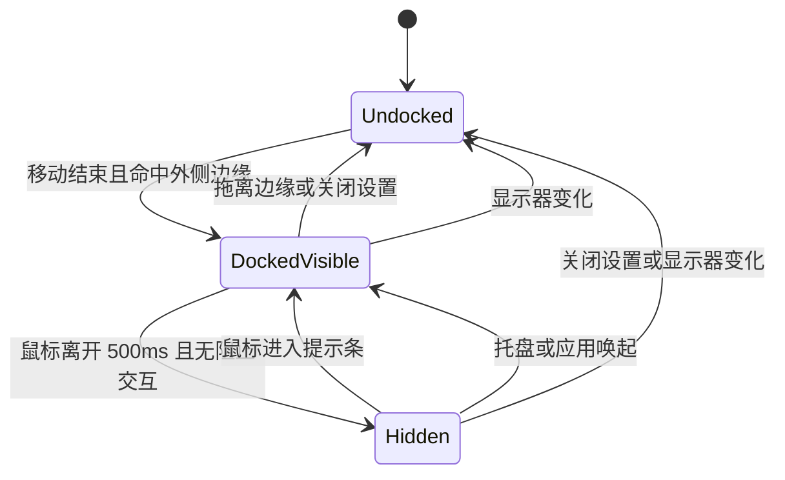

# 贴边自动隐藏功能设计开发文档

| 项目     | 内容                                           |
| -------- | ---------------------------------------------- |
| 文档版本 | v1.0                                           |
| 日期     | 2026-09-04                                     |
| 适用项目 | 悬浮便利贴 & 一键周报                          |
| 代码基线 | `codex/todo-details` / `5477b32`（文档编写时） |
| 目标版本 | 下一功能版本                                   |
| 状态     | 已实现，macOS 关键交互验收通过                 |
| 关联文档 | 《产品需求文档-悬浮便利贴与一键周报-v3.1》     |

---

## 1. 文档目的

本文档定义悬浮便利贴“贴边自动隐藏”功能的产品行为、窗口状态、屏幕边界算法、跨进程契约、配置兼容、异常恢复、测试方案和验收标准。

本文档是现有悬浮窗口能力的增量设计。未被本文档明确修改的行为，继续遵循现有 PRD、开发设计、设置设计和开发交接文档。

本次功能不得破坏以下既有能力：

- 便利贴无边框拖拽、自由缩放和位置尺寸记忆。
- “保持置顶”设置。
- 整窗紧凑模式及完整尺寸恢复。
- 托盘显示、隐藏和单实例唤起。
- 多显示器变化后的可见区域恢复。
- Renderer 沙箱、上下文隔离和 Preload 白名单边界。
- TXT 任务数据、归档和周报逻辑；本功能不得修改任何业务 TXT 格式。

---

## 2. 背景与目标

便利贴需要长期停留在桌面上，方便随时查看和记录，但完整窗口也可能遮挡当前工作的应用。用户希望获得类似 QQ 的贴边体验：把窗口拖到屏幕边缘后，窗口自动收起到屏幕外，只保留一条可发现的提示区域；鼠标再次靠近时，窗口恢复显示。

本次功能目标：

1. 用户可把便利贴停靠到当前屏幕的左侧、右侧或顶部。
2. 停靠后，鼠标离开 500 ms，便利贴自动隐藏。
3. 隐藏时保留 4 DIP 的提示条，鼠标进入后立即恢复。
4. 编辑任务、填写输入框或打开菜单时不自动隐藏。
5. 支持负坐标、多显示器、不同缩放比例以及任务栏/Dock 工作区。
6. 隐藏坐标不写入配置，重启后不会出现找不到窗口的情况。
7. 功能由设置项控制，默认关闭，升级后不改变现有用户行为。
8. 与现有紧凑模式、置顶、托盘和窗口恢复行为兼容。

---

## 3. 已确认的产品决定

### 3.1 支持方向

第一版支持：

- 左侧边缘。
- 右侧边缘。
- 顶部边缘。

第一版不支持底部自动隐藏。底部通常存在 Windows 任务栏或 macOS Dock，保留底部可见和可操作能够减少系统 UI 冲突。

### 3.2 触发方式

- 用户必须主动拖动便利贴到可停靠边缘附近。
- 窗口距离边缘不超过 12 DIP 时，移动结束后吸附到该边缘。
- 吸附只表示进入“停靠可见”状态，不立即隐藏。
- 鼠标离开便利贴后等待 500 ms，再进入隐藏状态。
- 鼠标在等待期间重新进入，立即取消隐藏计时。
- 鼠标进入隐藏提示条后立即恢复完整窗口。

### 3.3 设置项

在“设置 → 通用”中增加：

```text
贴边自动隐藏                         [开关]
拖到屏幕左侧、右侧或顶部后，鼠标离开时自动收起为边缘提示条。
```

- 默认值：关闭。
- 保存方式：沿用现有设置的可靠提交和多窗口广播机制。
- 关闭该设置时，如果便利贴正处于隐藏状态，必须先恢复为完整可见窗口，再清除停靠状态。
- 开启该设置后，如果便利贴已经位于合格边缘，可直接识别为停靠可见；否则等待用户下一次拖动。

### 3.4 提示条

- 可见厚度固定为 4 DIP。
- 颜色沿用当前便利贴颜色，并使用当前整窗不透明度。
- 提示条显示轻微高亮或方向标识，提示鼠标移入可展开。
- 隐藏状态不展示任务正文、菜单和可点击任务控件。
- 提示条不单独创建新窗口，继续使用原便利贴窗口，避免额外的窗口生命周期和焦点问题。

### 3.5 动效

第一版以跨平台一致和窗口可靠性为优先，不实现逐帧滑动动画：

- 隐藏和恢复通过一次原生窗口边界变更完成。
- 不使用 `BrowserWindow.setBounds(bounds, true)` 作为统一动画方案，因为不同平台行为不一致。
- 后续若增加动效，应作为独立优化，并补充高刷新率、多屏缩放和“减少动态效果”验收。

---

## 4. 范围与非目标

### 4.1 本期范围

- 左、右、顶部边缘检测和吸附。
- 停靠后的延迟隐藏和鼠标进入恢复。
- 4 DIP 提示条。
- 设置开关及配置持久化。
- 主进程窗口状态机。
- Main、Preload、Renderer 的最小跨进程契约。
- 多显示器外侧边缘判断。
- 显示器增加、移除或工作区变化后的安全恢复。
- 与紧凑模式、窗口缩放、托盘和置顶的组合行为。
- 自动化测试和 macOS/Windows 手工验收。

### 4.2 本期明确不做

- 底部自动隐藏。
- 用户自定义吸附阈值、隐藏延迟或提示条宽度。
- 磁吸式窗口排列、半屏布局或系统窗口分屏。
- 自动隐藏周记窗口或设置窗口。
- 保存“当前正处于隐藏状态”。
- 单独保存显示器 ID 或停靠方向。
- 跨平台逐帧滑入、滑出动画。
- 全局快捷键唤出便利贴。
- Linux 平台承诺。
- 修改任务 TXT、周文件或周报数据。

---

## 5. 术语与坐标约定

| 术语     | 定义                                                      |
| -------- | --------------------------------------------------------- |
| 工作区   | Electron `Display.workArea`，不含任务栏或 Dock 的可用区域 |
| DIP      | Electron 窗口 API 使用的设备无关像素                      |
| 停靠     | 窗口吸附到左、右或顶部边缘，并具备自动隐藏资格            |
| 停靠可见 | 窗口完整显示在工作区内，但已记录停靠方向                  |
| 自动隐藏 | 窗口大部分内容不可见，只留下 4 DIP 提示条                 |
| 外侧边缘 | 边缘外侧没有另一块显示器工作区覆盖的桌面边界              |
| 内侧接缝 | 两块显示器相邻的连接边界，不允许自动隐藏                  |

所有阈值、边界和窗口坐标统一使用 DIP，不自行乘除 `scaleFactor`。

---

## 6. 用户交互设计

### 6.1 停靠

1. 用户从现有标题栏拖拽区域移动便利贴。
2. Windows 优先使用原生 `moved` 事件判断移动结束；macOS 的 `moved` 是 `move` 的别名，因此使用连续 150 ms 无新移动事件作为兼容性判定。
3. 计算窗口与当前显示器左、右、顶部边缘的距离。
4. 最近边缘距离不超过 12 DIP，且该边缘是外侧边缘时，窗口吸附到边缘。
5. 吸附后完整窗口仍然可见，用户可继续操作。
6. 若不满足条件，状态为未停靠，窗口保持用户放置的位置。

`will-move` 可辅助识别手动移动，因为程序化 `setBounds()` 不触发该事件；但它不能单独表示拖动已经结束。macOS 的防抖方案需要实机确认，避免用户按住鼠标停顿时过早吸附。

### 6.2 边角优先级

窗口同时接近两个可用边缘时：

1. 选择距离更小的边缘。
2. 距离相同时，左侧或右侧优先于顶部。

侧边提示条占据完整窗口高度，更容易重新发现；明确优先级也能避免同一位置在不同运行中选择不同方向。

### 6.3 自动隐藏

满足以下全部条件时启动 500 ms 隐藏计时：

- 设置已开启。
- 当前状态为停靠可见。
- 鼠标已经离开便利贴。
- 当前没有阻止自动隐藏的交互。
- 窗口没有正在进行的用户拖动、缩放或程序化位置调整。

计时结束时再次检查全部条件。任一条件不满足则不隐藏。

### 6.4 阻止自动隐藏的交互

以下情况暂时阻止自动隐藏：

- 便利贴菜单已打开。
- 正在编辑任务标题或详情。
- 新增任务输入框或其他文本输入控件正在编辑。
- 正在保存任务或等待紧凑模式切换完成。

阻止状态结束后，如果鼠标已经位于窗口外且窗口仍停靠，则重新开始 500 ms 计时。

普通按钮获得焦点不会永久阻止隐藏。键盘用户可通过默认关闭该功能、设置开关或托盘“显示便利贴”恢复窗口。

### 6.5 恢复

以下行为会立即恢复隐藏窗口：

- 鼠标进入 4 DIP 提示条。
- 托盘选择“显示便利贴”。
- 再次启动应用触发单实例唤起。
- macOS Dock 激活应用。
- 代码调用现有 `showFloatingNote()`。
- 用户关闭“贴边自动隐藏”设置。

通过托盘或应用激活恢复时，窗口保持停靠方向，但在下一次真实鼠标离开前不主动重新隐藏，避免刚唤出就再次消失。

### 6.6 取消停靠

- 用户将停靠可见窗口拖离边缘超过 12 DIP 后，清除停靠状态。
- 用户开始手动拖动停靠窗口时，立即取消隐藏计时并临时清除停靠；松手后再按最终位置重新检测。
- 关闭贴边自动隐藏设置时，清除停靠状态。
- 当前停靠边缘因显示器布局变化成为内侧接缝时，清除停靠状态。
- 停靠取消后，鼠标离开不再触发自动隐藏。

### 6.7 隐藏时的界面

Renderer 根据主进程广播的停靠快照切换显示：

- 正常内容临时设为不可交互，防止提示条上的点击误触任务按钮。
- 在实际露出的窗口一侧显示提示条覆盖层。
- 左侧隐藏时，提示条位于窗口右缘。
- 右侧隐藏时，提示条位于窗口左缘。
- 顶部隐藏时，提示条占据整个缩小后的窗口。
- 提示条设置 `title="展开便利贴"`，但不依赖 tooltip 作为唯一提示。

---

## 7. 平台差异方案

### 7.1 左侧和右侧

左右隐藏通过把窗口主体移出工作区实现，同时保留 4 DIP：

```text
左侧隐藏 x = workArea.x - window.width + 4
右侧隐藏 x = workArea.x + workArea.width - 4
```

窗口的 y、width、height 保持不变；y 必须限制在当前工作区内，保证提示条具有可操作高度。

### 7.2 顶部

Electron 37 在 macOS 上会限制 BrowserWindow 的最小 y 坐标，窗口不能可靠移动到系统菜单栏上方。因此顶部不能统一使用“把完整窗口移到屏幕外”的方案。

第一版顶部隐藏统一采用“缩小原窗口高度”的跨平台方案：

```text
x      = 停靠可见时的 x
y      = workArea.y
width  = 停靠可见时的 width
height = 4
```

隐藏前临时把窗口最小高度降为 4，并禁用用户缩放；恢复时重新应用正常模式或紧凑模式对应的最小尺寸和 `resizable` 状态。

这一实现对用户仍表现为顶部只留 4 DIP 提示条，同时避开 macOS 菜单栏坐标限制。

### 7.3 工作区而非物理屏幕

- 边界计算必须使用 `workArea`，不能使用完整 `bounds`。
- Windows 自动隐藏任务栏可能改变工作区，需要监听显示器 metrics 变化。
- macOS 顶部停靠位置从菜单栏下方的工作区起点计算。
- Dock 位于左侧或右侧时，对应工作区边界自然向内收缩，不覆盖 Dock。

---

## 8. 多显示器设计

### 8.1 当前显示器选择

使用 `screen.getDisplayMatching(windowBounds)` 选择与窗口重叠面积最大的显示器。不能只按窗口左上角或主显示器判断，否则负坐标和跨屏窗口会选错。

### 8.2 内侧接缝保护

便利贴不允许隐藏到另一块显示器中。

生成候选隐藏矩形后，检查其位于当前工作区外的主体部分是否与其他显示器的 `workArea` 相交：

- 不相交：该边缘是外侧边缘，可以停靠并隐藏。
- 相交：该边缘属于内侧接缝，不进入停靠状态。

这项判断必须考虑窗口在另一轴上的实际跨度。例如上下错位的两块显示器，只在真正重叠的接缝区阻止隐藏。

### 8.3 显示器变化

监听：

- `display-added`
- `display-removed`
- `display-metrics-changed` 中的 `bounds`、`workArea`、`scaleFactor`、`rotation`

发生变化时：

1. 取消移动防抖、隐藏计时和程序化过渡。
2. 如果便利贴处于隐藏状态，先按保存的停靠可见边界恢复。
3. 使用现有 `restoreVisibleBounds()` 修正为可见位置。
4. 清除停靠状态。
5. 保存修正后的完整可见边界。
6. 广播新的未停靠状态。

显示器布局变化后不自动重新隐藏，优先保证窗口可以找回。

---

## 9. 状态模型

### 9.1 运行时状态

主进程是窗口停靠状态的唯一事实来源：

```typescript
export type NoteDockEdge = 'left' | 'right' | 'top';

export type NoteDockPhase = 'undocked' | 'docked-visible' | 'hidden';

export interface NoteDockSnapshot {
  edge: NoteDockEdge | null;
  phase: NoteDockPhase;
}

interface NoteDockRuntimeState extends NoteDockSnapshot {
  displayId: number | null;
  visibleBounds: Rectangle | null;
  pointerInside: boolean;
  interactionBlocked: boolean;
}
```

`visibleBounds` 始终表示完整可见时的停靠位置。隐藏矩形只临时计算，不作为可恢复位置持久化。

### 9.2 状态转换



程序化 `setBounds()` 期间必须设置保护标志，相关 `move` 和 `resize` 事件不能再次触发边缘检测、保存隐藏矩形或递归改变状态。

### 9.3 不持久化隐藏状态

配置只保存完整可见边界和功能开关：

- 不保存 `phase: hidden`。
- 不保存隐藏后的 x、y 或 4 DIP 高度。
- 不要求保存 `displayId`。
- 重启时根据已保存的完整边界是否贴在合格边缘，重新推导停靠方向。

应用崩溃或强制退出后，即使最后正在隐藏，下次启动也会从完整可见边界恢复。

---

## 10. 边界计算模块

建议新增纯函数模块：

```text
src/main/platform/noteAutoHide.ts
```

建议职责：

```typescript
detectDockCandidate(bounds, displays, threshold): DockCandidate | null
snapVisibleBounds(bounds, workArea, edge): Rectangle
getHiddenBounds(visibleBounds, workArea, edge, revealSize): Rectangle
isExternalDockEdge(candidate, displays): boolean
```

### 10.1 候选距离

```text
leftGap  = bounds.x - workArea.x
rightGap = workArea.x + workArea.width - (bounds.x + bounds.width)
topGap   = bounds.y - workArea.y

leftDistance  = max(0, leftGap)
rightDistance = max(0, rightGap)
topDistance   = max(0, topGap)
```

只接受原始 gap 小于等于 `EDGE_SNAP_THRESHOLD` 的候选，并要求窗口与目标工作区在另一轴有有效重叠。这样窗口轻微越过边缘时仍能吸附，但完全位于工作区外的窗口不会被错误认定为停靠候选。

### 10.2 吸附边界

- 左侧：固定 x 为 `workArea.x`，限制 y 完整位于工作区。
- 右侧：固定窗口右缘为工作区右缘，限制 y 完整位于工作区。
- 顶部：固定 y 为 `workArea.y`，限制 x 完整位于工作区。
- 另一轴尽量保留用户拖动结果，只在越界时进行最小幅度修正。

### 10.3 建议常量

```typescript
export const EDGE_SNAP_THRESHOLD = 12;
export const EDGE_REVEAL_SIZE = 4;
export const EDGE_HIDE_DELAY_MS = 500;
export const WINDOW_MOVE_SETTLE_MS = 150;
```

常量统一放在共享常量或平台模块中，测试不得散落魔法数字。

---

## 11. WindowManager 设计

`WindowManager` 继续拥有 BrowserWindow，并负责状态编排：

### 11.1 新增职责

- 记录停靠运行时状态。
- 对用户移动事件进行防抖并检测边缘。
- 区分用户移动与程序化窗口移动。
- 监听手动移动开始事件并立即解除旧停靠状态。
- 管理 500 ms 隐藏计时器。
- 在停靠期间按真实屏幕坐标轮询鼠标是否位于完整 BrowserWindow 内。
- 应用左、右、顶部隐藏几何。
- 向 Renderer 广播 `NoteDockSnapshot`。
- 在设置、托盘、紧凑模式和显示器变化时安全恢复。

### 11.2 建议私有字段

```typescript
#dockState: NoteDockRuntimeState
#moveSettleTimer: NodeJS.Timeout | null
#autoHideTimer: NodeJS.Timeout | null
#programmaticBoundsChange = false
```

现有 `#boundsTimer` 继续只负责完整可见边界的持久化，不与移动结束检测共用，避免一个定时器承担两种语义。

### 11.3 建议公开方法

```typescript
getNoteDockState(): NoteDockSnapshot
setNoteInteractionState(input: NoteInteractionState): void
```

现有方法行为调整：

- `showFloatingNote()`：如果隐藏，先恢复，再显示和聚焦。
- `toggleFloatingNote()`：隐藏到托盘与贴边隐藏是两个概念；可见但贴边隐藏时执行“显示”应恢复，而不是把窗口隐藏到托盘。
- `setFloatingNoteCollapsed()`：若贴边隐藏，先恢复；调整尺寸后按原边缘重新吸附。
- `saveCurrentBounds()`：停靠时保存 `visibleBounds`，绝不读取隐藏矩形作为持久化值。
- `applySettings()`：处理开关开启、关闭和隐藏恢复。
- `closeAll()`：清理全部新增定时器和 screen 事件监听。

### 11.4 窗口尺寸策略统一

顶部隐藏、正常模式和紧凑模式都会修改最小高度与 `resizable`。应新增单一内部方法统一应用尺寸策略，避免恢复后仍不可缩放：

```text
顶部隐藏：minHeight = 8，resizable = false
紧凑可见：minHeight = 64，resizable = false
正常可见：minHeight = 280，resizable = true
```

恢复流程必须先设置允许的最小尺寸，再设置目标 bounds，最后应用稳定状态对应的 `resizable`。

---

## 12. 配置设计

### 12.1 新字段

`config.json` 增加：

```json
{
  "edge_auto_hide": false
}
```

共享类型增加：

```typescript
interface AppConfig {
  edge_auto_hide: boolean;
}

interface SettingsSnapshot {
  edgeAutoHideEnabled: boolean;
}

interface SettingsPatch {
  edgeAutoHideEnabled?: boolean;
}
```

### 12.2 兼容策略

- 继续使用现有 `schema_version: 2`。
- 旧配置缺少 `edge_auto_hide` 时按 `false` 补齐并写回。
- 非布尔值按 `false` 回退并记录字段校验日志。
- 保留当前 ConfigService 对未知未来字段的兼容行为。
- `resources/default-config.json` 与 `DEFAULT_CONFIG` 必须同步。

### 12.3 设置提交

`SettingsService` 把：

```text
edgeAutoHideEnabled ↔ edge_auto_hide
```

加入现有可靠提交映射。只有配置落盘成功后，`WindowManager.applySettings()` 才改变运行时行为并向窗口广播设置快照；失败时设置页恢复上一次成功值。

---

## 13. IPC 与 Preload 契约

### 13.1 新增类型

```typescript
export interface NoteInteractionState {
  pointerInside: boolean;
  autoHideBlocked: boolean;
}
```

### 13.2 新增通道

```text
window:get-note-dock-state
window:set-note-interaction-state
event:note-dock-state-changed
```

### 13.3 Preload API

```typescript
interface ElectronAPI {
  window: {
    getNoteDockState(): Promise<NoteDockSnapshot>;
    setNoteInteractionState(input: NoteInteractionState): Promise<void>;
  };
  events: {
    onNoteDockStateChanged(listener: (snapshot: NoteDockSnapshot) => void): () => void;
  };
}
```

### 13.4 输入校验

- Main 必须通过严格 Zod object 校验 `NoteInteractionState`。
- 不接受 Renderer 提供坐标、显示器 ID、边缘方向或窗口尺寸。
- Renderer 只能报告自身交互状态，不能直接决定窗口移动目标。
- Preload 不暴露通用 `ipcRenderer`。

Renderer 挂载时先注册事件监听，再读取当前快照，避免初始化期间遗漏状态变化；卸载时必须执行退订函数。

---

## 14. Renderer 设计

主要修改：

```text
src/renderer/pages/FloatingNotePage.tsx
src/renderer/pages/SettingsPage.tsx
src/renderer/styles/globals.css
src/renderer/dev/mockElectronAPI.ts
```

### 14.1 交互状态上报

`FloatingNotePage` 统一计算：

```typescript
const autoHideBlocked =
  menuOpen || activeEditingKey !== null || textInputFocused || saving || collapsePending;
```

在以下变化时上报：

- 根节点 `pointerenter` / `pointerleave`。
- 文本输入控件 `focusin` / `focusout`。
- 菜单开关。
- 编辑态、保存态和紧凑切换态变化。

对连续相同状态去重，避免 React 重渲染产生重复 IPC。

Renderer 的根节点指针事件只用于快速反馈；主进程的 `screen.getCursorScreenPoint()` 与窗口矩形判断是悬停状态的最终依据。因为 `-webkit-app-region: drag` 会屏蔽标题栏内的 DOM 指针事件，不能仅依赖 Renderer 判断鼠标是否仍在窗口内。

### 14.2 停靠状态展示

- 订阅 `onNoteDockStateChanged`。
- `phase === 'hidden'` 时展示提示条覆盖层。
- 正常内容设置为不可交互且不进入 Tab 顺序。
- 提示条的实际方向由 `edge` 决定。
- 鼠标进入根节点时先上报 `pointerInside: true`；主进程恢复后再显示正常内容。

### 14.3 设置页

在现有“通用”卡片中，把“贴边自动隐藏”放在“保持置顶”之后。开关沿用 `SettingSwitch`、保存中禁用、成功提示和失败回滚机制。

### 14.4 Mock

Renderer Mock 必须：

- 默认返回 `edgeAutoHideEnabled: false`。
- 默认返回 `{ edge: null, phase: 'undocked' }`。
- 记录最后一次 `NoteInteractionState`。
- 提供触发停靠状态事件的测试辅助方法。

---

## 15. 与现有功能的组合规则

### 15.1 紧凑模式

- 正常窗口和紧凑窗口都可以停靠到左、右或顶部。
- 紧凑模式停靠左右时，提示条高度等于 64 DIP。
- 紧凑模式停靠顶部时，仍缩小为 4 DIP 高度。
- 隐藏状态点击托盘、鼠标进入提示条或打开菜单时，先恢复当前紧凑/正常尺寸。
- 切换紧凑状态前先恢复隐藏窗口；切换完成后重新按原方向吸附。
- `#expandedNoteBounds` 始终保存正常模式完整尺寸，不被 4 DIP 顶部提示条覆盖。

### 15.2 置顶

- 自动隐藏不修改 `always_on_top` 设置。
- `show_on_fullscreen` 默认开启，但只有 `always_on_top` 同时开启时才生效。
- macOS 生效时调用 `setVisibleOnAllWorkspaces(true, { visibleOnFullScreen: true })`，让便利贴进入其他桌面和常规全屏 Space。
- 关闭“保持置顶”时同步把 `show_on_fullscreen` 保存为 false；重新开启置顶后由用户决定是否再次开启全屏显示。
- 提示条继承便利贴当前置顶层级。
- 关闭置顶后，提示条可能被其他窗口覆盖，这是用户设置的预期结果。

### 15.3 托盘显示/隐藏

- “隐藏便利贴”调用真正的 `BrowserWindow.hide()`。
- “显示便利贴”先恢复贴边隐藏，再 `show()` 和 `focus()`。
- 托盘菜单的可见状态继续基于 `BrowserWindow.isVisible()`；贴边隐藏仍属于窗口可见。
- 托盘单击处于贴边隐藏状态时，应执行恢复，而不是再隐藏到托盘。

### 15.4 关闭窗口

现有无边框便利贴没有系统关闭按钮，但任何调用 `close()` 的路径仍保持“隐藏到托盘、不退出应用”的规则。关闭前不持久化隐藏矩形。

### 15.5 窗口缩放

- 用户只能在停靠可见状态缩放窗口。
- 缩放事件结束后重新计算吸附位置和 `visibleBounds`。
- 顶部隐藏和紧凑状态不可缩放。

---

## 16. 窗口边界保存与启动恢复

### 16.1 保存规则

| 当前状态  | 写入 `window_bounds` 的内容                      |
| --------- | ------------------------------------------------ |
| 未停靠    | 当前完整可见 bounds                              |
| 停靠可见  | 吸附后的完整可见 bounds                          |
| 左/右隐藏 | 对应 `visibleBounds`                             |
| 顶部隐藏  | 高度恢复前的 `visibleBounds`                     |
| 紧凑模式  | 现有 `expandedNoteBounds` 的尺寸，加当前可见位置 |

### 16.2 启动规则

1. 使用现有 `restoreVisibleBounds()` 恢复完整窗口。
2. 若开关关闭，按普通窗口显示。
3. 若开关开启且恢复后的窗口精确位于合格外侧边缘，推导为停靠可见。
4. 首次显示完整窗口；在窗口加载完成、鼠标不在窗口内且无阻止交互时，可按 500 ms 规则隐藏。
5. 不直接以隐藏状态创建窗口，避免首屏失败时只留下不可诊断的细条。

---

## 17. 异常与恢复策略

### 17.1 Renderer 未响应

- Main 不依赖 Renderer 提供窗口坐标。
- Renderer 崩溃后不继续启动新的自动隐藏计时。
- 托盘“显示便利贴”始终尝试恢复完整可见边界。
- 页面重新加载后通过 `getNoteDockState()` 获取权威状态。

### 17.2 程序化移动事件回声

`setBounds()` 会产生 `move` 或 `resize` 事件。程序化调整期间：

- 跳过移动结束检测。
- 跳过普通 bounds 保存。
- 只在目标边界稳定后清除保护标志。

不得只依赖“下一次 move 事件”清除标志，因为某些平台在目标位置未变化时可能不发事件。

### 17.3 意外隐藏坐标

即使旧版本或异常路径把隐藏坐标写入配置，现有 `restoreVisibleBounds()` 仍应把不足最小可见区域的窗口恢复到主屏。新增测试需要覆盖 4 DIP 提示条坐标的恢复兜底。

### 17.4 设置保存失败

- 设置页开关回滚到上一次成功值。
- WindowManager 不改变自动隐藏运行态。
- 若此前已隐藏，不因失败的“关闭”操作提前清除停靠状态。

### 17.5 快速往返

- 每次隐藏计时使用唯一 generation 或先取消旧 timer。
- 鼠标快速进入、离开不会形成多个待执行计时器。
- 显示器变化、窗口关闭和应用退出必须清理 timer。

---

## 18. 日志与诊断

建议记录以下低频事件：

- 进入停靠：方向、displayId、可见 bounds。
- 自动隐藏：方向和触发原因。
- 恢复：方向和触发来源，例如 pointer、tray、activate、setting。
- 因内侧接缝拒绝停靠。
- 显示器变化导致恢复和取消停靠。
- 无法应用窗口边界的异常。

不记录：

- 每次鼠标进入或离开。
- 每个窗口 move 事件。
- 任务正文、详情或其他用户业务数据。

---

## 19. 文件修改范围

### 19.1 预计修改

```text
src/shared/constants.ts
src/shared/domain.ts
src/main/platform/displayBounds.ts
src/main/platform/noteAutoHide.ts                 新增
src/main/services/configService.ts
src/main/services/settingsService.ts
src/main/ipc/channels.ts
src/main/ipc/schemas.ts
src/main/ipc/settingsHandlers.ts 或平台 Handler
src/main/windowManager.ts
src/main/index.ts
src/preload/apiTypes.ts
src/preload/index.ts
src/renderer/pages/FloatingNotePage.tsx
src/renderer/pages/SettingsPage.tsx
src/renderer/styles/globals.css
src/renderer/dev/mockElectronAPI.ts
resources/default-config.json
```

### 19.2 预计新增或修改测试

```text
tests/integration/platform/noteAutoHide.test.ts    新增
tests/integration/platform/displayBounds.test.ts
tests/integration/services/settingsService.test.ts
tests/integration/platform/configService.test.ts
tests/integration/ipc/settingsHandlers.test.ts
tests/unit/contracts.test.ts
tests/renderer/mock-electron-api.test.ts
tests/renderer/floating-note-page.test.tsx
tests/renderer/settings-page.test.tsx
```

### 19.3 不应修改

- Today/Week Parser 和 Repository。
- ArchiveService、Scheduler 和 FileWatcher。
- 周报 Agent、模板和远程 LLM 网络策略。
- 业务 TXT 文件格式。

---

## 20. 分阶段实施计划

### 阶段 0：基线和契约冻结

- 记录当前工作区已有未提交修改，避免覆盖无关改动。
- 运行 typecheck、lint、test、build 基线。
- 冻结新配置字段、共享类型和 IPC 名称。

退出标准：现有失败有记录；共享契约可以同时供 Main、Preload、Renderer 使用。

### 阶段 1：纯边界算法与配置

- 实现边缘候选、吸附、隐藏矩形和内侧接缝纯函数。
- 增加 `edge_auto_hide` 默认值、解析和设置映射。
- 完成负坐标、多显示器和旧配置测试。

退出标准：平台几何不依赖真实 BrowserWindow 即可完整测试。

### 阶段 2：WindowManager 状态机

- 实现移动结束防抖、状态转换和 timer 生命周期。
- 实现左右移出和顶部缩高。
- 保护持久化 bounds。
- 接入显示器变化、托盘唤起和紧凑模式。

退出标准：主进程状态转换测试通过，任何恢复路径都能得到完整可见窗口。

### 阶段 3：IPC 与 Renderer

- 新增最小白名单契约和严格校验。
- 上报鼠标与阻止交互状态。
- 渲染提示条并屏蔽隐藏内容交互。
- 在设置页增加开关，更新 Mock。

退出标准：Renderer 测试覆盖设置、菜单、编辑和提示条恢复。

### 阶段 4：组合验证和平台验收

- 运行全量质量门禁。
- macOS 和 Windows 实机验证三方向行为。
- 验证多屏、任务栏/Dock、缩放比例、紧凑模式和托盘。
- 记录平台差异和遗留限制。

退出标准：本文第 22 节验收标准全部通过，或明确记录经用户接受的例外。

---

## 21. 测试策略

### 21.1 纯函数测试

- 左、右、顶部 12 DIP 内命中。
- 13 DIP 外不命中。
- 正好 12 DIP 命中。
- 边角按距离选择，等距时侧边优先。
- 正坐标、负坐标和非主屏工作区。
- 另一轴超出时正确钳制。
- 左右隐藏只保留 4 DIP。
- 顶部隐藏高度为 4 DIP。
- 邻接显示器阻止内侧接缝隐藏。
- 错位显示器只阻止真正相交的接缝区。

### 21.2 状态机与计时测试

- 移动停止 150 ms 后才检测停靠。
- 鼠标离开 499 ms 不隐藏，500 ms 隐藏。
- 计时期间进入窗口会取消隐藏。
- 菜单、任务编辑、文本输入和保存状态阻止隐藏。
- 阻止状态结束且鼠标在外时重新计时。
- 提示条 mouseenter 立即恢复。
- 鼠标停留在可拖拽标题栏时保持展开。
- 展开后开始手动拖动会立即解除旧停靠，拖离边缘后不再隐藏。
- 关闭设置时隐藏窗口恢复并取消停靠。
- 程序化 move/resize 不触发二次停靠或错误保存。
- 窗口销毁后没有遗留 timer。

### 21.3 配置与 IPC 测试

- 旧配置缺少字段时默认为 false。
- 非布尔配置回退并写回。
- 设置保存成功后应用运行态并广播。
- 设置保存失败时不改变运行态。
- IPC 拒绝缺字段、额外字段和非布尔输入。
- Mock 与生产 ElectronAPI 契约保持一致。

### 21.4 Renderer 测试

- 设置页正确展示默认关闭和保存后的开启状态。
- 根节点进入、离开只上报必要状态。
- 打开菜单或进入任务编辑时 `autoHideBlocked` 为 true。
- 关闭菜单或退出编辑时解除阻止。
- hidden 快照显示正确方向提示条并隐藏任务控件。
- 提示条鼠标进入请求恢复。
- 事件监听在卸载时被移除。

### 21.5 手工平台测试

macOS 11+ 与 Windows 10/11 分别执行：

1. 左、右、顶部停靠、隐藏和恢复。
2. 顶部提示条不覆盖菜单栏，左右提示条不覆盖任务栏/Dock。
3. 100%、125%、150% 或 Retina 缩放。
4. 主屏位于左、右、上、下的多屏布局。
5. 内侧接缝不隐藏，桌面外侧边缘可以隐藏。
6. 隐藏时拔掉所在显示器，窗口回到可见区域。
7. 正常与紧凑模式分别停靠。
8. 打开菜单、编辑任务和填写新增输入时不隐藏。
9. 托盘单击、单实例启动和应用激活可以唤回。
10. 重启后保存的是完整窗口尺寸，不是 4 DIP 或屏幕外坐标。
11. 开关默认关闭，升级旧配置后现有行为不变。

---

## 22. 验收标准

2026-09-04 验收记录：自动化质量门禁全部通过；macOS 实机确认 4 DIP 提示条、可拖拽标题栏悬停保持展开，以及展开后拖离边缘立即解除隐藏状态。Windows 与复杂多显示器布局仍需在对应环境补充平台验收。

- [ ] 设置中存在“贴边自动隐藏”开关，默认关闭且可持久化。
- [ ] 开关关闭时，现有窗口拖拽、缩放和位置记忆行为不变。
- [ ] 开关开启后，距左、右或顶部边缘 12 DIP 内松手可以吸附。
- [ ] 距边缘超过 12 DIP 不吸附、不隐藏。
- [ ] 停靠后鼠标离开 500 ms 才隐藏。
- [ ] 隐藏时仅保留 4 DIP 提示条。
- [ ] 鼠标进入提示条立即恢复完整窗口。
- [ ] 菜单、任务编辑、文本输入和保存期间不会隐藏。
- [ ] 底部边缘不会触发自动隐藏。
- [ ] 多显示器内侧接缝不会把窗口隐藏到相邻显示器。
- [ ] 显示器变化后便利贴恢复为完整可见窗口。
- [ ] 托盘、单实例和应用激活可以恢复隐藏窗口。
- [ ] 正常模式和紧凑模式都能正确停靠与恢复。
- [ ] 隐藏矩形和 4 DIP 高度不会写入 `window_bounds`。
- [ ] 重启后不会出现窗口丢失、仅剩 4 DIP 高度或无法缩放。
- [ ] macOS 顶部隐藏不尝试越过系统菜单栏。
- [ ] Renderer 仍然无法直接调用 Electron 窗口 API 或提交窗口坐标。
- [ ] 业务 TXT、归档和周报内容完全不受影响。
- [ ] TypeScript、ESLint、Vitest 和生产构建全部通过。
- [ ] macOS 与 Windows 的关键窗口行为完成手工验收。

---

## 23. 风险与缓解

### 23.1 无完整 Electron GUI E2E

窗口位置、焦点、多屏和系统工作区行为无法仅靠 jsdom 完整验证。

缓解：把几何和状态转换提取为纯逻辑；自动测试覆盖大部分分支，真实窗口行为通过 macOS 与 Windows 手工验收，后续纳入 Playwright Electron E2E。

### 23.2 macOS 顶部坐标限制

直接把窗口移到菜单栏上方不可依赖。

缓解：顶部统一缩小为 4 DIP 高度；恢复时严格重设最小尺寸与可缩放状态。

### 23.3 程序化移动事件循环

隐藏、恢复和吸附都会触发 move/resize，可能造成重复检测和错误持久化。

缓解：明确区分用户移动与程序化边界变更，使用独立保护标志和独立 timer，并对事件回声补测试。

### 23.4 提示条被其他窗口覆盖

用户关闭“保持置顶”后，4 DIP 提示条可能被普通窗口遮挡。

缓解：这是置顶设置的自然结果；托盘“显示便利贴”、单实例唤起和应用激活始终可恢复。不开启自动隐藏仍是默认行为。

### 23.5 提示条过窄

4 DIP 在高分辨率设备上仍使用 DIP，但对部分用户可能不易命中。

缓解：整条边都可触发，并由主进程轮询真实鼠标坐标扩大触发可靠性；当前按用户反馈固定为 4 DIP，后续再评估是否提供可配置选项。

---

## 24. Definition of Done

功能只有在同时满足以下条件时才视为完成：

- 本文已确认的左、右、顶部行为全部实现。
- 配置、共享类型、IPC、Preload、Renderer Mock 和真实实现保持一致。
- 隐藏窗口的任何恢复入口都能得到完整、可操作、可缩放的正确尺寸。
- 自动化测试覆盖边界纯函数、状态计时、设置兼容、IPC 校验和 Renderer 交互。
- 全量 `typecheck`、`lint`、`test`、`build` 通过。
- macOS 和 Windows 完成手工验收，特别是顶部、内侧接缝、缩放和显示器拔插。
- 没有修改业务 TXT 格式、任务语义或周报数据流。
- 开发交接文档补充实现状态、平台验证结果和已知限制。
